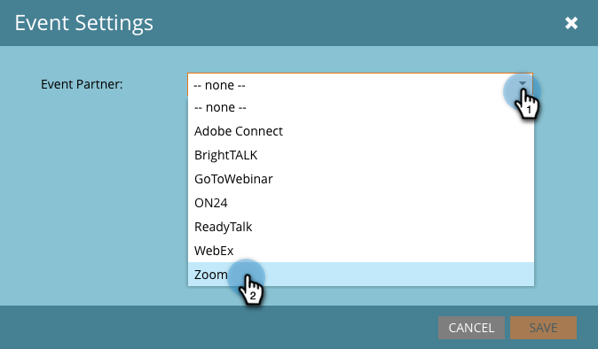

# Creare un evento con zoom {#create-an-event-with-zoom}

>[!PREREQUISITES]
>
>* [Aggiungere zoom come servizio LaunchPoint](/help/marketo/product-docs/administration/additional-integrations/add-zoom-as-a-launchpoint-service.md)
* [Creare un nuovo programma evento](/help/marketo/product-docs/demand-generation/events/understanding-events/create-a-new-event-program.md)
* Imposta le [azioni di flusso appropriate](/help/marketo/product-docs/core-marketo-concepts/smart-campaigns/flow-actions/add-a-flow-step-to-a-smart-campaign.md)per tenere traccia del coinvolgimento

Crea prima il tuo webinar in Zoom. Alcune impostazioni nella creazione dello Zoom vengono utilizzate da Marketo, altre solo da Zoom.

Dopo aver creato un evento Marketo e associato un webinar Zoom, i sistemi potranno condividere le informazioni di registrazione e partecipazione. Per informazioni sulla creazione di un webinar, consulta [Guida introduttiva agli zoom Webinar](https://support.zoom.us/hc/en-us/articles/200917029-Getting-Started-With-Webinar).

Immetti le seguenti informazioni per il tuo webinar e verrà estratto in Marketo tramite l&#39;adattatore. Se apporti modifiche a queste informazioni, devi fare clic sul collegamento &quot;Aggiorna dal provider di webinar&quot; in Azioni evento, in modo che Marketo possa vedere le modifiche.

**Titolo e descrizione**

* **Nome webinar**  - Inserisci il nome del webinar. Questo nome sarà visibile in Marketo.

* **Descrizione**  (facoltativo) - Inserite la descrizione del webinar. La descrizione sarà visibile in Marketo.

**Data e ora**

* **Data di inizio**  - Inserisci la data di inizio. Questo sarà visibile in Marketo.

* **Ora di inizio**  - Inserisci l&#39;ora di inizio. Questo sarà visibile in Marketo.

* **Durata**  - Inserire la durata. L’ora di inizio e l’ora di fine saranno visualizzabili in Marketo.

* **Fuso orario** : seleziona il fuso orario applicabile. Questo sarà visibile in Marketo.

* **Webinar ricorrente** - Mantieni deselezionato.

* **Registrazione**  - Seleziona questa casella per rendere obbligatoria la registrazione. Utilizzerai un modulo Marketo/pagina di destinazione per acquisire le informazioni di registrazione che verranno inviate a Zoom.

>[!NOTE]
Marketo al momento non supporta i webinar ricorrenti. È necessario impostare una singola sessione tra ciascun webinar Marketo Event e Zoom.

>[!TIP]
In Zoom sono disponibili ulteriori campi da configurare che NON influiranno sull’integrazione. Per ulteriori informazioni su questi campi, fare riferimento al [Centro assistenza per i webinar con zoom](https://support.zoom.us/hc/en-us/sections/200324965-Video-Webinar).

Ora, saltiamo su Marketo!

1. Seleziona un evento. Fare clic su **Azioni evento** e scegliere **Impostazioni evento**.

   

   >[!NOTE]
   Il tipo di canale dell&#39;evento selezionato deve essere **webinar**.

1. Scegli **Zoom** dall&#39;elenco **Evento** **Partner**.

   

1. Scegliere l’account Zoom a cui associare l’evento.

   

1. Seleziona il webinar.

   

1. Fare clic su **Salva**.

   

   Eccellente! Ora l’evento viene sincronizzato e pianificato tramite Zoom.

   >[!NOTE]
   I campi inviati da Marketo sono: Nome, Cognome, Indirizzo E-Mail.

   >[!TIP]
   Per popolare l’e-mail di conferma con questo URL univoco, utilizza il seguente token nella tua e-mail: `{{member.webinar url}}`. Quando l’URL di conferma viene inviato, questo token viene automaticamente risolto nell’URL di conferma univoco della persona.
   Imposta il tuo messaggio e-mail di conferma su **Operativo** per assicurarti che le persone che si registrano e possono essere cancellate ricevano comunque le loro informazioni di conferma.

   Le persone che si iscrivono al tuo webinar verranno inviate al provider tramite il passaggio di flusso **Cambia stato programma** quando il nuovo stato è impostato su &quot;Registrato&quot;. Nessun altro stato invierà la persona. Inoltre, assicurati di fare **Cambia stato programma** passaggio di flusso #1 e **Invia e-mail** passaggio di flusso #2.

   

   >[!CAUTION]
   Evita di utilizzare programmi e-mail nidificati per inviare le e-mail di conferma. Utilizza invece la campagna intelligente del programma dell’evento, come illustrato in precedenza.

   >[!TIP]
   La visualizzazione dei dati in Marketo può richiedere fino a 48 ore. Se dopo aver aspettato così a lungo non vedi ancora nulla, seleziona **Aggiorna dal provider di webinar** dal menu Azioni evento nella scheda **Riepilogo** dell&#39;evento.
