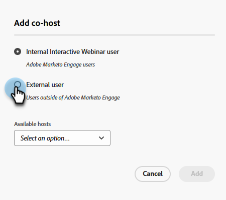
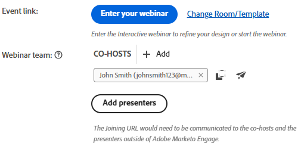

# Aggiungi un team di webinar {#add-a-webinar-team}

Un team di webinar nei webinar interattivi è costituito da tutti i ruoli che contribuiscono alla corretta distribuzione del webinar in Adobe Connect. Ciò include sia i relatori che i co-host.

>[!NOTE]
>
>I relatori e i co-host in Marketo si associano esattamente ai ruoli di presentatore e co-host durante il webinar in Adobe Connect.

Il presentatore è un ruolo esterno che partecipa alla distribuzione dell’esperienza del webinar, mentre i co-host possono fungere da presentatore e gestire gli aspetti amministrativi della distribuzione del webinar. I co-host possono essere sia interni che esterni. I co-host esterni non avranno accesso ai programmi di eventi di webinar interattivi in Marketo, ma disporranno delle autorizzazioni co-host durante la consegna in Adobe Connect. I co-host interni avranno accesso sia al programma Interactive Webinar Event in Marketo sia alle autorizzazioni co-host durante la consegna. Questo aiuta a garantire che i co-host interni possano prendere le redini del programma di eventi del webinar interattivo quando il creatore originale del programma del webinar interattivo non fa più parte del set di utenti del webinar interattivo o non fa nemmeno parte di un utente Marketo.

>[!PREREQUISITES]
>
>[Creare un webinar interattivo](/help/marketo/product-docs/demand-generation/events/interactive-webinars/create-an-interactive-webinar.md)

## Aggiungi un co-host {#add-a-co-host}

1. Nella pagina Panoramica del webinar interattivo, fai clic su **Aggiungi co-host**.

   

1. Puoi aggiungere utenti interni o esterni. In questo esempio, sceglieremo esterno.

   

   >[!NOTE]
   >
   >Se si seleziona **Utente interno del webinar interattivo**, è sufficiente fare clic sul pulsante **Host disponibili** e scegliere dall’elenco di persone che sono state aggiunte come utenti di webinar interattivi nel Marketo Engage.

1. Immetti il nome, il cognome e l&#39;indirizzo e-mail del co-host desiderato. Clic **Aggiungi**.

   

1. Il nuovo co-host verrà visualizzato nella sezione del team del webinar.

   

## Aggiungi un presentatore {#add-a-presenter}

1. Nella pagina Panoramica del webinar interattivo, fai clic su **Aggiungi relatori**.

   

1. Immetti il nome, il cognome e l&#39;indirizzo e-mail del relatore desiderato. Clic **Aggiungi**.

   

   >[!NOTE]
   >
   >Le informazioni del relatore saranno rese disponibili ad Adobe Connect durante la consegna del webinar, in modo che i dettagli appropriati possano essere compilati automaticamente senza che l’utente debba immetterli durante la registrazione per la consegna del webinar.

1. Il nuovo relatore verrà visualizzato nella sezione del team del webinar.

   

>[!TIP]
>
>Dopo aver aggiunto un team di webinar, puoi fare clic sull’icona Copia accanto a ciascun utente per copiare (e condividere) gli URL di unione.

>[!MORELIKETHIS]
>
>[Creare un webinar interattivo](/help/marketo/product-docs/demand-generation/events/interactive-webinars/create-an-interactive-webinar.md)
