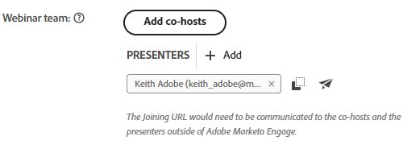

# Aggiungi un team di webinar {#add-a-webinar-team}

Un team di webinar nei webinar interattivi è costituito da tutti i ruoli che contribuiscono alla corretta distribuzione del webinar in Adobe Connect. Ciò include sia i relatori che i co-host.

>[!PREREQUISITES]
>
>* [Crea un webinar interattivo](/help/marketo/product-docs/demand-generation/events/interactive-webinars/create-an-interactive-webinar.md){target="_blank"}
>
>* [Progetta il tuo webinar interattivo](/help/marketo/product-docs/demand-generation/events/interactive-webinars/designing-interactive-webinars.md){target="_blank"}

Il presentatore è un ruolo esterno che partecipa alla distribuzione dell’esperienza del webinar, mentre i co-host possono fungere da presentatore e gestire gli aspetti amministrativi della distribuzione del webinar. I co-host possono essere sia interni che esterni. I co-host esterni non avranno accesso ai programmi di eventi di webinar interattivi in Marketo, ma disporranno delle autorizzazioni host durante la consegna in Adobe Connect. I co-host interni avranno accesso sia al programma Interactive Webinar Event in Marketo sia alle autorizzazioni host durante la consegna. Questo aiuta a garantire che i co-host interni possano prendere le redini del programma di eventi del webinar interattivo quando il creatore originale del programma del webinar interattivo non fa più parte del set di utenti del webinar interattivo o non fa nemmeno parte di un utente Marketo.

>[!NOTE]
>
>I relatori e i co-host in Marketo Engage corrispondono esattamente ai ruoli di presentatore e host durante la consegna del webinar in Adobe Connect. I co-host possono modificare i layout e i pod, mentre i relatori non possono.

## Aggiungi un co-host {#add-a-co-host}

1. Nella pagina Panoramica del webinar interattivo, fai clic su **Aggiungi co-host**.

   

1. Puoi aggiungere utenti interni o esterni. In questo esempio, sceglieremo esterno.

   

   >[!NOTE]
   >
   >Se selezioni **Utente interno del webinar interattivo**, dovrai semplicemente fare clic sul menu a discesa **Host disponibili** e scegliere dall&#39;elenco di persone che sono state aggiunte come utenti del webinar interattivo in Marketo Engage. Gli host esistenti non verranno visualizzati in questo elenco a discesa, in quanto sono già host.

1. Immetti il nome, il cognome e l&#39;indirizzo e-mail del co-host desiderato. Fai clic su **Aggiungi**.

   

1. Il nuovo co-host verrà visualizzato nella sezione del team del webinar.

   

>[!NOTE]
>
> L&#39;icona  copia l&#39;URL di join co-host e l&#39;icona  invia al co-host un&#39;e-mail di invito.

## Aggiungi un presentatore {#add-a-presenter}

1. Nella pagina Panoramica del webinar interattivo, fai clic su **Aggiungi relatori**.

   

1. Immetti il nome, il cognome e l&#39;indirizzo e-mail del relatore desiderato. Fai clic su **Aggiungi**.

   

   >[!NOTE]
   >
   >Le informazioni del relatore saranno rese disponibili ad Adobe Connect durante la consegna del webinar, in modo che i dettagli appropriati possano essere compilati automaticamente senza che l’utente debba immetterli durante la registrazione per la consegna del webinar.

1. Il nuovo relatore verrà visualizzato nella sezione del team del webinar.

   

>[!NOTE]
>
> L&#39;icona  copia l&#39;URL di partecipazione del relatore e l&#39;icona  invia al relatore un&#39;e-mail di invito.

>[!MORELIKETHIS]
>
>[Crea un webinar interattivo](/help/marketo/product-docs/demand-generation/events/interactive-webinars/create-an-interactive-webinar.md){target="_blank"}
