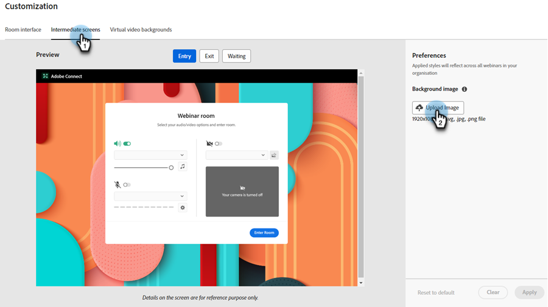

# Personalizzazione dei webinar interattivi {#interactive-webinars-customization}

La personalizzazione dei webinar è fondamentale per creare un’esperienza più coinvolgente ed efficace per i partecipanti.

I webinar interattivi offrono diverse opzioni di personalizzazione per adattare l’ambiente del webinar alle tue esigenze. Personalizza l’aspetto di diverse schermate per riflettere il marchio della tua organizzazione.

Puoi personalizzare le seguenti opzioni:

* Colori del marchio per la camera
* Sfondo personalizzato per rappresentare l’organizzazione nelle schermate di entrata, uscita e attesa
* Logo
* Sfondi video virtuali

## Concedere le autorizzazioni {#grant-permissions}

Prima che qualsiasi utente dell’organizzazione possa personalizzare i webinar interattivi, un amministratore di Marketo Engage deve innanzitutto aggiungere l’accesso ai ruoli desiderati.

1. In Marketo Engage fare clic su **[!UICONTROL Amministratore]**.

   

1. Fai clic su **[!UICONTROL Utenti e ruoli]**, quindi sulla scheda **[!UICONTROL Ruoli]**.

   

1. Fare doppio clic sul ruolo a cui si desidera aggiungere le autorizzazioni.

   

1. Fare clic per aprire **[!UICONTROL Access Design Studio]**.

   

1. Selezionare la casella di controllo **[!UICONTROL Accedi alla personalizzazione dei webinar interattivi]**.

   

## Personalizzare le schermate dei webinar interattivi {#customize-interactive-webinar-screens}

1. Passare a **Design Studio**.

   

1. Fai clic su **Webinar interattivi** e seleziona **Personalizza webinar**.

   

1. È possibile personalizzare l&#39;interfaccia della stanza, gli schermi immediati o gli sfondi video virtuali.

   

### Personalizzare l&#39;interfaccia della room {#customize-the-room-interface}

È possibile personalizzare l&#39;aspetto della sala riunioni modificando il logo, il collegamento di reindirizzamento selezionabile e i colori. Le modifiche verranno applicate a tutti gli eventi e a tutte le room dell&#39;organizzazione.

Per personalizzare l&#39;aspetto di una room, selezionare la scheda Interfaccia room dalla barra dei menu.

1. Nel pannello a destra, personalizzate le seguenti preferenze:

   

   **Logo personalizzato**: seleziona Carica logo e sfoglia l&#39;immagine dal dispositivo. Le dimensioni dell&#39;immagine non devono superare i 50 x 31 pixel e possono essere in diversi formati di file: svg, gif, jpg e png. È possibile modificare o eliminare il logo.

   **Collegamento di reindirizzamento**: aggiungi un URL per reindirizzare i partecipanti dopo che hanno fatto clic sul logo.

   **Testo alternativo**: aggiungere un testo alternativo per i partecipanti utilizzando le funzionalità di accesso facilitato.

   **Colori**: selezionare i colori per la barra della stanza, le icone della stanza, lo sfondo della stanza, la barra del pod e le sezioni/icone del pod per modificare il colore delle diverse sezioni.

   È inoltre possibile immettere il codice colore HEX utilizzando l&#39;opzione HEX.

   Selezionare **[!UICONTROL Visualizza modelli]** per modificare il tema della room.

   Dopo aver apportato le modifiche, è possibile controllare il logo e i colori in Anteprima.

1. Seleziona **[!UICONTROL Applica]** per salvare le modifiche. Per ripristinare le impostazioni predefinite, fare clic su **[!UICONTROL Ripristina impostazioni predefinite]**.

   

### Personalizzare le schermate intermedie {#customize-intermediate-screens}

Cambia l&#39;immagine di sfondo per cambiare l&#39;aspetto delle schermate di entrata, uscita e attesa. Le modifiche vengono applicate a tutti gli eventi e a tutte le room dell’organizzazione.

Per personalizzare l&#39;aspetto di una stanza, selezionare la scheda Schermi intermedi nella barra dei menu.

1. Nel pannello di destra, personalizzare l&#39;immagine di sfondo selezionando **Carica immagine** e cerca un logo in un&#39;immagine. Le dimensioni dell&#39;immagine non devono superare i 1920 x 1080 pixel e possono essere in diversi formati di file: svg, gif, jpg e png. Se necessario, è possibile modificare o eliminare il logo.

   

   >[!NOTE]
   >
   >L’immagine caricata viene applicata nelle schermate Entrata, Uscita e In attesa.

1. Seleziona **[!UICONTROL Applica]** per salvare le modifiche. Per ripristinare le impostazioni predefinite, fare clic su **[!UICONTROL Ripristina impostazioni predefinite]**.

### Personalizzare gli sfondi di video virtuali {#Customize-virtual-video-backgrounds}

Durante gli eventi, utilizza sfondi definiti dall&#39;organizzazione per visualizzare il logo o l&#39;immagine del marchio dell&#39;organizzazione sullo sfondo del feed video della fotocamera. Per aggiungere gli sfondi virtuali della tua organizzazione, seleziona la scheda Sfondi video virtuali dalla barra dei menu. Puoi scegliere di mostrare solo gli sfondi personalizzati, Adobe Connect o entrambi.

**Sfondi personalizzati**

1. Fai clic sull’interruttore di attivazione per consentire sfondi personalizzati negli eventi e nelle sale.

   

1. Seleziona **Carica sfondo** per caricare uno sfondo personalizzato. Le dimensioni dell&#39;immagine non devono superare i 1920 x 1080 pixel e possono essere in diversi formati di file: svg, gif, jpg e png.

Passa il cursore del mouse sull’immagine di sfondo personalizzata per eliminarla dagli sfondi video.

Dopo aver apportato le modifiche, visualizzare lo sfondo in Anteprima.

È possibile utilizzare il dispositivo di scorrimento nella schermata Anteprima per ingrandire o ridurre e verificare l&#39;aspetto dello sfondo virtuale se l&#39;utente si trova vicino o lontano dalla fotocamera. Se sullo sfondo è presente del testo, questo contribuirà a garantirne la visibilità.

1. Seleziona **[!UICONTROL Applica]** per salvare le modifiche. Per ripristinare le impostazioni predefinite, fare clic su **[!UICONTROL Ripristina impostazioni predefinite]**.

**Sfondi Adobe Connect**

Adobe Connect fornisce nove sfondi predefiniti pronti per l’uso. Potete visualizzarne l&#39;aspetto in Anteprima.

Utilizza l’interruttore di attivazione per controllare la disponibilità di questi sfondi predefiniti negli eventi e nelle sale.

Seleziona **Applica** per salvare le modifiche o **Ripristina impostazioni predefinite** per ripristinare le impostazioni predefinite.
