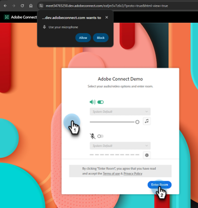

# Consegnare un webinar interattivo {#deliver-an-interactive-webinar}

Il webinar interattivo è pronto per iniziare. Scopri tutto quello che devi sapere sulla sua presentazione.

1. Seleziona l&#39;evento e fai clic su **Inserisci il tuo webinar**.

   

   >[!NOTE]
   >
   >Si consiglia di eseguire questa operazione almeno 15 minuti prima dell’ora di inizio pianificata.

1. Se sei un co-host o un relatore, fai clic sul collegamento personalizzato nell’e-mail ricevuta per il webinar.

   

1. Seleziona le preferenze audio/video e fai clic su **Accedi alla stanza**.

   

1. Selezionare il layout da mostrare ai primi join.

   

   >[!NOTE]
   >
   >I partecipanti possono entrare nella stanza fino a 15 minuti prima dell&#39;inizio pianificato e visualizzeranno il layout attivo. Consigliamo di progettare un layout &#39;Lobby&#39; per loro.

   >[!TIP]
   >
   >Attivate la funzione Controlli di trasmissione per accedere a una stanza verde virtuale. Ciò consente agli ospiti e ai relatori di parlare e vedere gli altri senza che l&#39;audio e il video vengano trasmessi ai partecipanti nella stanza. È ideale prima e dopo la sessione, dove puoi testare l’audio e il video o debrief dopo il webinar.

1. Se necessario, puoi registrare la sessione. Selezionare **Registra sessione** dal menu della room. La registrazione può essere interrotta in un secondo momento dallo stesso menu.

   

1. La sessione inizia all&#39;ora specificata.

1. Fare clic sul nome della room. Nell&#39;elenco a discesa, selezionare **Area host e presentatore** per chattare o condividere le note con il team della presentazione nel backstage. L&#39;area host e presentatore si apre sul lato destro dello schermo. Solo gli host, i co-host e i relatori possono visualizzare questa parte dello schermo.

   

1. Al termine della sessione, fare clic sull&#39;icona freccia rossa e selezionare **Termina sessione per tutti**.

   

   >[!CAUTION]
   >
   >Facendo clic su Chiudi stanza si esce dalla stanza. **not** terminerà il webinar.

   >[!TIP]
   >
   >Ulteriori informazioni su [prestazioni e registrazioni eventi](/help/marketo/product-docs/demand-generation/events/interactive-webinars/event-workflows.md){target="_blank"}.

## Esperienza partecipante {#participant-experience}

I partecipanti possono partecipare al webinar facendo clic sul collegamento personalizzato ricevuto dopo la registrazione all&#39;evento.

1. I partecipanti che avviano il collegamento dell’evento più di 15 minuti prima dell’inizio pianificato visualizzano una pagina di destinazione in cui si informano di attendere l’inizio dell’evento.

   

1. I partecipanti devono selezionare le proprie preferenze audio e quindi fare clic su Entra nella room. I partecipanti che entrano per la prima volta in una stanza di Adobe Connect visualizzeranno anche una finestra a comparsa del browser per ottenere l&#39;autorizzazione per il microfono. Adobe Connect ha bisogno di questo accesso per consentire ai partecipanti di utilizzare il microfono in un secondo momento all’interno della stanza.

   

   >[!NOTE]
   >
   >Il popup di autorizzazione può essere chiuso senza fornire l’accesso. I partecipanti dovranno fornire l&#39;accesso all&#39;interno della stanza se tenteranno di attivare il microfono.

## Impostazioni e aree {#settings-and-areas}

### Area host e presentatore {#host-and-presenter-area}

L&#39;area &quot;Host &amp; Presenter&quot; (detta anche &quot;Backstage&quot;) è un&#39;area privata situata sul lato destro di una sala riunioni, visibile solo agli ospiti e ai relatori. Può essere utilizzato per collaborare prima, durante e dopo un evento. Utilizza Chat, Note e altri pod come backchannel all’interno dell’area Host e Presenter.

Per accedere, selezionare **Area presentatore e host** dal menu a discesa della room. Ulteriori informazioni su quest&#39;area sono disponibili nel [video seguente](https://www.youtube.com/watch?v=11GkcvIUttY){target="_blank"}.

### Controlli di trasmissione {#broadcast-controls}

Broadcast Control aggiunge una sala verde virtuale alla sessione dei webinar interattivi. Consente a conduttori e presentatori di parlare e vedersi privatamente senza trasmettere ai partecipanti nella stanza. È un ottimo modo per testare il microfono e la webcam prima di una sessione. I relatori possono inoltre collaborare nell&#39;area Host e Presenter fino a quando non sono pronti per andare live. Fornisce un modo per l&#39;oratore e i produttori di discutere con gli altri privatamente dopo una sessione, nel caso un partecipante dimentichi di lasciare il webinar.

I controlli di trasmissione possono essere impostati in modo da iniziare automaticamente la registrazione dopo l&#39;uscita dalla sala verde. In questo modo gli host non devono ricordarsi di avviare e arrestare manualmente la registrazione. Anche la messa in pausa o l&#39;arresto della trasmissione causerà la sospensione o l&#39;arresto della registrazione. Tutto è automatico.

Ulteriori informazioni sui controlli di trasmissione [ in questo video](https://www.youtube.com/watch?v=TcoCeEJoyjg){target="_blank"}.

### Chat nelle registrazioni {#chats-in-recordings}

A seconda del caso d’uso, potrebbe essere utile includere o escludere la chat in-room all’interno delle registrazioni dell’evento.

Le discussioni all’interno dei pod di chat vengono sempre registrate. Quindi, se le discussioni di chat aggiungono valore ai visualizzatori di registrazione (i partecipanti e i visualizzatori on-demand pubblicano l’evento live), utilizza i chat pod durante la progettazione della stanza.

La discussione nel pannello Chat non viene registrata. Il pannello Chat libera anche l&#39;immobile che sarebbe stato occupato dal pod di chat all&#39;interno del layout. Quindi, se le discussioni di chat non aggiungeranno valore ai visualizzatori di registrazione, utilizza il Pannello Chat invece di chat pod durante la progettazione della room.

Ulteriori informazioni su [il pannello chat](https://helpx.adobe.com/adobe-connect/using/notes-chat-q-a-polls.html#chat_panel){target="_blank"}.

### Modalità Prepara {#prepare-mode}

La modalità Prepara consente agli host e ai relatori di creare o modificare il layout di una sala riunioni in background durante una sessione, ma senza che i partecipanti visualizzino le modifiche finché l&#39;host non le rende visibili. La funzione Modalità di preparazione evidenzia i pod live in blu e i pod non live in bianco.

Per utilizzare la modalità Prepara:

1. Fare clic sull&#39;icona chiave inglese nella parte inferiore del pannello Layout.

   

1. Nel pannello Layout, scegliete il layout da regolare. Spostare, nascondere o visualizzare i pod in base alle esigenze. Puoi anche aggiornare il contenuto in pod, ad esempio caricare una nuova versione della presentazione in un pod condiviso.

1. Al termine delle modifiche, scegliere **Fine modalità preparazione** dal menu a discesa oppure fare clic sull&#39;icona a forma di chiave inglese una seconda volta.

Questa opzione disattiva la modalità Prepara e consente di tornare al layout attivo.

Ulteriori informazioni sulla modalità di preparazione [in questo video](https://www.youtube.com/watch?v=kUya84sx-E4){target="_blank"}.

>[!NOTE]
>
>* Qualsiasi modifica apportata ai pod live viene immediatamente riportata ai partecipanti.
>* [Il pannello chat](https://helpx.adobe.com/adobe-connect/using/notes-chat-q-a-polls.html#chat_panel){target="_blank"} non fa parte della modalità Prepara e qualsiasi modifica apportata verrà immediatamente visualizzata ai partecipanti.

### Accessibilità {#accessibility}

L’Adobe si sforza di includere relatori e partecipanti con disabilità migliorando l’accessibilità dei webinar interattivi. Il software viene continuamente migliorato per soddisfare le esigenze di tutti i tipi di utenti e per rispettare gli standard mondiali che includono le persone con disabilità visive, uditive, di mobilità o di altro tipo.

Scopri come Adobe Connect fornisce assistenza per [esigenze visive, uditive e di mobilità](https://helpx.adobe.com/adobe-connect/using/accessibility-features.html){target="_blank"}.

### Sottotitoli {#closed-captions}

I sottotitoli codificati sono una rappresentazione testuale dell’audio all’interno di una room di Adobe Connect e consentono ai partecipanti non udenti o ipoudenti di partecipare agli eventi. È possibile integrare sottotitoli in tempo reale di contenuti audio negli eventi e presentarli nella visualizzazione sottotitoli.

Scopri come [abilitare i sottotitoli](https://helpx.adobe.com/adobe-connect/using/closed-captioning-html-client.html){target="_blank"}.
