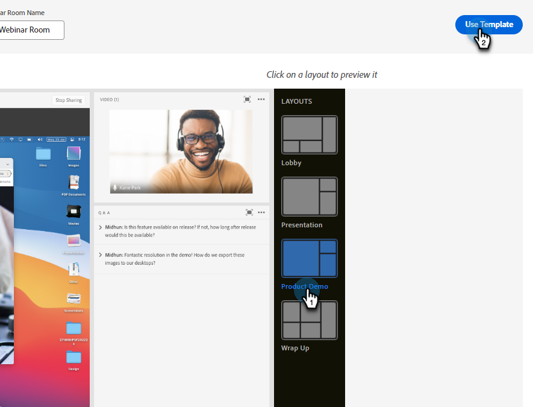

# Progettazione di webinar interattivi {#designing-interactive-webinars}

Scopri come progettare il tuo webinar in base alle tue esigenze.

1. Seleziona l’evento e fai clic su **Progettazione del webinar**.

   

1. È possibile scegliere una stanza webinar esistente o crearne una nuova. In questo esempio ne stiamo creando uno nuovo, quindi fai clic sul pulsante **Seleziona stanza** a discesa e scegli **Nuova sala webinar interattiva**.

   

   >[!NOTE]
   >
   >Una stanza è uno spazio online utilizzato per condurre riunioni.

1. Scegli un modello.

   

1. Verrà visualizzata l’anteprima del tuo webinar.

   

1. È possibile selezionare diversi layout da visualizzare in anteprima. Per continuare, fai clic su **Usa modello**.

   

1. Puoi perfezionare il tuo webinar immediatamente o successivamente. Facciamolo ora. Fai clic su **Migliora il tuo webinar ora**.

   

1. Seleziona le preferenze audio/video e fai clic su **Sala**.

   

1. Il modello selezionato è ora modificabile.

   

1. Per informazioni dettagliate su camere e modelli, controllare la sezione &quot;Modelli e layout delle sale riunioni&quot; di [articolo della guida di questo Adobe](https://helpx.adobe.com/in/adobe-connect/using/creating-arranging-meetings.html#creating_and_arranging_meetings){target="_blank"}.

1. Al termine della progettazione del webinar, fai clic su **Sala di uscita**.

   

## Elementi di progettazione {#design-elements}

**Modello**: Struttura fornita a una stanza in base all&#39;obiettivo del webinar che viene consegnato. Ad esempio, se desideri pianificare un webinar relativo a una presentazione del prodotto, la condivisione dello schermo è un componente essenziale per mostrare la demo. Il modello assicura che i componenti essenziali necessari per una consegna efficace di un particolare tipo di webinar siano in atto durante la configurazione della stanza del webinar.

**Layout**: Si riferisce a diversi modi in cui i diversi componenti necessari per garantire il successo del webinar sono disposti in un particolare modello. Un singolo modello può avere più layout tra cui scegliere. I componenti essenziali del webinar rimarranno gli stessi tra i vari modelli. La disposizione selezionata sarebbe più adatta allo stile/alle esigenze di voi o del presentatore che consegna il webinar.

**Pod**: Un componente all’interno di un modello che esegue una particolare attività durante il webinar. Ad esempio, l’impostazione e la distribuzione di un sondaggio per acquisire le risposte dei partecipanti in un’attività che può essere soddisfatta da un poll pod. Allo stesso modo, chattare con i partecipanti per trasmettere un messaggio o interagire casualmente con loro può essere un&#39;attività effettuata attraverso il pod chat. Sono disponibili più altri pod, come Condividi, Note, Video, Chat, Elenco partecipanti, File, Collegamenti web, Sondaggi e Domande e Risposte.
