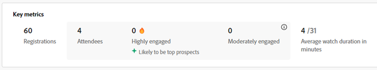
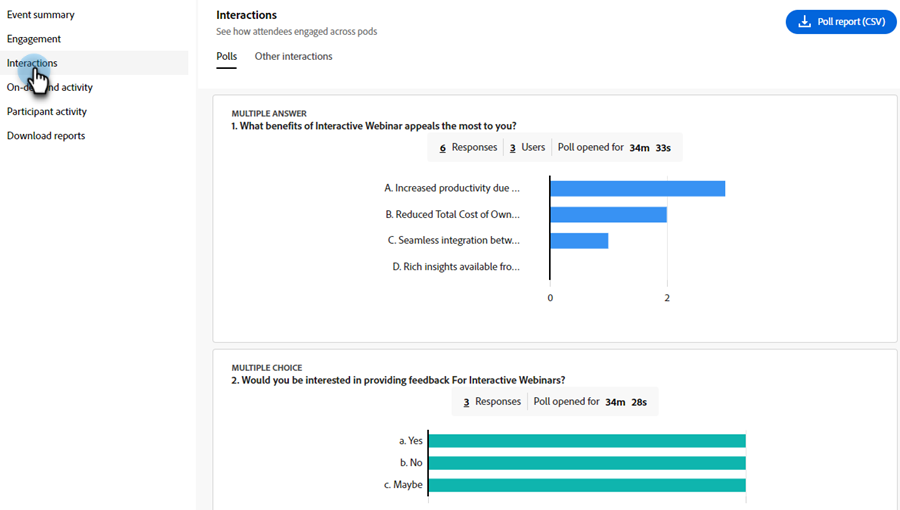
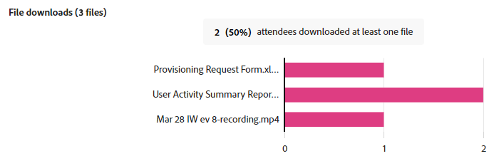

# Dashboard di coinvolgimento {#engagement-dashboard}

I webinar interattivi basati su Adobe Connect utilizzano vari pod per coinvolgere i partecipanti in chat, domande e risposte, quiz e sondaggi. La dashboard del coinvolgimento consente di tenere traccia delle metriche chiave e delle visualizzazioni dei dati.

Visualizzare una visualizzazione consolidata delle attività, delle interazioni e del coinvolgimento dei partecipanti durante un evento. In qualità di host, puoi visualizzare le prestazioni di eventi live e on-demand e scaricare vari rapporti dopo la sessione. Inoltre, i rapporti post-webinar generati dalla dashboard vengono utilizzati per valutare l’efficacia della sessione, informare i contenuti futuri e migliorare la strategia complessiva del webinar.

La dashboard tiene traccia di varie metriche, tra cui risposte ai sondaggi, attività di chat e interazioni video, offrendo informazioni preziose sulle preferenze e i comportamenti dei partecipanti. Offre una panoramica completa delle attività dei partecipanti e dei livelli di coinvolgimento, consentendo agli host di monitorare la partecipazione, la partecipazione e le interazioni in tempo reale.

Visualizza il coinvolgimento per i seguenti tipi di sessioni in un webinar interattivo.

* **Sessione live**: una sessione online in tempo reale in cui i partecipanti possono interagire attivamente tra loro.
* **Sessione on demand**: la registrazione dell&#39;evento live è disponibile come evento proprio. I nuovi invitati possono registrarsi e guardare la registrazione. Dopo la registrazione, riceveranno un collegamento di unione evento, che li porterà alla registrazione dell’evento al termine. Anche i partecipanti registrati per l&#39;evento live possono visualizzare la registrazione utilizzando lo stesso collegamento di unione.

## Visualizzare il dashboard {#view-the-dashboard}

1. Vai a **[!UICONTROL Attività di marketing]**.

   

1. Seleziona l’evento completato desiderato.

   

1. In Panoramica, fare clic su **[!UICONTROL Visualizza dashboard di coinvolgimento]**.

   

   >[!NOTE]
   >
   >Il dashboard del coinvolgimento è accessibile da 45 a 120 minuti dopo il termine dell’evento pianificato.

## Dettagli Cruscotto {#dashboard-details}

Puoi visualizzare i seguenti dettagli nel dashboard del coinvolgimento.

<table><tbody>
  <tr>
    <td><b>Riepilogo eventi</td>
    <td>Fornisce una visualizzazione consolidata delle prestazioni delle sessioni live e on-demand.</td>
  </tr>
  <tr>
    <td><b>Coinvolgimento</td>
    <td>Offre una panoramica delle prestazioni delle sessioni live.</td>
  </tr>
  <tr>
    <td><b>Interazioni</td>
    <td>Offre una visualizzazione dettagliata del coinvolgimento dei partecipanti nei diversi pod.</td>
  </tr>
  <tr>
    <td><b>Attività on-demand</td>
    <td>Riepilogo delle prestazioni di registrazione.</td>
  </tr>
  <tr>
    <td><b>Attività partecipante</td>
    <td>Offre una visualizzazione consolidata del coinvolgimento.</td>
  </tr>
  <tr>
    <td><b>Scaricare i rapporti</td>
    <td>Scarica i rapporti di coinvolgimento in diversi pod.</td>
  </tr>
</tbody>
</table>

### Riepilogo eventi {#event-summary}

Questa interfaccia fornisce una vista consolidata delle prestazioni dell’evento per le sessioni live e on-demand. Dal pannello a sinistra, seleziona Riepilogo eventi per visualizzare le metriche generali.

<table><tbody>
  <tr>
    <td><b>Registrazioni totali</td>
    <td>Mostra il numero di partecipanti che si sono registrati all'evento.</td>
  </tr>
  <tr>
    <td><b>Partecipanti totali</td>
    <td>Mostra il numero di partecipanti che hanno partecipato all’evento.</td>
  </tr>
  <tr>
    <td><b>Tasso di conversione per la registrazione al partecipante</td>
    <td>Mostra la percentuale di partecipanti che si sono registrati e hanno partecipato all'evento.</td>
  </tr>
  <tr>
    <td><b>Partecipazione degli spettatori sia in diretta che on-demand</td>
    <td>Questo mostra il numero di partecipanti che hanno partecipato sia a eventi live che on-demand.</td>
  </tr>
</tbody>
</table>

### Coinvolgimento {#engagement}

Offre una panoramica delle prestazioni di un evento durante una sessione live. La panoramica include metriche chiave, coinvolgimento nel tempo e interazioni dei partecipanti. Aiuta gli organizzatori a valutare il successo dell’evento e a identificare aree di miglioramento.

Dal pannello a sinistra, seleziona **[!UICONTROL Coinvolgimento]** per visualizzare le prestazioni della sessione live. **[!UICONTROL Fai clic su Riepilogo coinvolgimento (PDF)]** per scaricare il riepilogo delle prestazioni della sessione live. La panoramica fornisce dati in diverse sezioni.

**Metriche chiave**

Visualizza il numero di registrazioni, partecipanti e coinvolgimento nella sessione in tempo reale.

<table><tbody>
  <tr>
    <td><b>Registrazioni</td>
    <td>Visualizza il numero di registrazioni per la sessione live.</td>
  </tr>
  <tr>
    <td><b>Partecipazione</td>
    <td>Visualizza il numero di partecipanti presenti alla sessione live.</td>
  </tr>
  <tr>
    <td><b>Molto coinvolto</td>
    <td>Visualizza il numero di partecipanti altamente coinvolti durante la sessione in diretta e che probabilmente saranno i principali potenziali clienti.</td>
  </tr>
  <tr>
    <td><b>Moderatamente coinvolto</td>
    <td>Visualizza il numero di partecipanti moderatamente coinvolti durante la sessione in diretta.
     <b>Nota</b>: questi numeri vengono calcolati in base al coinvolgimento e alle interazioni durante la sessione.</td>
  </tr>
  <tr>
    <td><b>Durata media controllo in minuti</td>
    <td>Visualizza la durata media di osservazione in minuti della sessione in tempo reale.</td>
  </tr>
</tbody>
</table>

**Coinvolgimento nel tempo**

Dai grafici di coinvolgimento, scopri il coinvolgimento medio nel tempo durante la sessione live. Gli host possono monitorare la fluttuazione dei livelli di coinvolgimento, consentendo loro di identificare i momenti critici di interazione alta o bassa. Scopri quanto del punteggio medio di coinvolgimento è stato ottenuto dai partecipanti coinvolti in diversi layout.

Passando il puntatore del mouse sul grafico, puoi visualizzare le seguenti informazioni:

* Il momento in cui viene monitorato il livello di coinvolgimento.
* Punteggio medio di coinvolgimento in quel momento.
* Numero di partecipanti impegnati in quel momento.
* Layout del coinvolgimento in quel momento.
* Selezionare **[!UICONTROL Visualizza l&#39;istante in registrazione]** per visualizzare l&#39;istante in cui il coinvolgimento è stato alto o basso.
* Punteggio medio di coinvolgimento (%) nel tempo nella sessione
* Partecipazione nel tempo durante la sessione
* La partecipazione a diversi layout di webinar viene mostrata quando diversi layout sono stati utilizzati all’interno della stanza durante l’evento. Aiuta a correlare l&#39;aumento e la diminuzione del coinvolgimento in diversi layout.

**Interazioni partecipanti**

È possibile visualizzare le interazioni dei partecipanti da diversi pod. Fornisce informazioni quali sondaggi con risposta, domande, Interagire con la chat, Clic su almeno un collegamento e Download di almeno un file.

Seleziona **[!UICONTROL Vai alle interazioni]** per visualizzare le risposte dai sondaggi, dalle metriche di Controllo qualità e dalle reazioni dei partecipanti durante la sessione. Scopri in che modo i partecipanti vengono coinvolti nei diversi pod dei rapporti sulle interazioni e scarica i rapporti sulle interazioni dalla sezione seguente.

### Interazioni {#interactions}

Visualizzare il modo in cui i partecipanti interagiscono e interagiscono nella sessione da Interactions. Monitora risposte a sondaggi, metriche di controllo qualità, reazioni dei partecipanti e collegamenti e file rilasciati dai rispettivi pod. Gli host possono anche scaricare i rapporti di interazione di questi pod per una migliore analisi. Analizzando queste interazioni, puoi identificare le tendenze e adattare le loro strategie per incoraggiare un ambiente più interattivo e coinvolgente.

Dal pannello a sinistra, seleziona **[!UICONTROL Interazioni]** per visualizzare il modo in cui i partecipanti vengono coinvolti tra i pod.

Seleziona la scheda **[!UICONTROL Sondaggi]** dalla barra dei menu per visualizzare le domande e le risposte aggiunte al sondaggio. Questa scheda mostra le seguenti informazioni:

* Seleziona **[!UICONTROL Rapporto sondaggio (CSV)]** per scaricare il rapporto per le interazioni nel pod di sondaggio.
* Domanda di sondaggio e relativo tipo.
* Numero di risposte e periodo durante il quale il sondaggio è stato aperto e attivato.
* Seleziona **Visualizza tutte le `<number>` risposte** per visualizzarle in una finestra di dialogo.

Seleziona la scheda **[!UICONTROL Altre interazioni]** dalla barra dei menu per visualizzare il coinvolgimento in altri pod e scaricare i relativi rapporti.

Seleziona **[!UICONTROL Scarica rapporti interazione]** dal menu a discesa per scaricare rapporti di diversi pod. Scarica il rapporto Controllo di qualità, il rapporto Collegamenti e file e il rapporto Reazioni da qui per un migliore tracciamento.

Le informazioni sul coinvolgimento tra i pod sono disponibili in diverse sezioni.

**Metriche QnA**

Visualizza i seguenti attributi del pod domande e risposte.

* Totale domande poste.
* Numero di domande senza risposta.
* Numero di partecipanti che hanno posto domande.
* Numero di partecipanti che hanno posto più di una domanda e che probabilmente saranno i potenziali clienti principali.
* Tempo medio impiegato per rispondere a una domanda.

**Reazioni**

Guarda le reazioni dei partecipanti da qui, come essere d&#39;accordo, in disaccordo, applauditi e ridenti durante la sessione.

Dal grafico delle reazioni, visualizza i seguenti dettagli:

* Reazioni totali
* Numero di partecipanti che hanno risposto almeno una volta
* Clic totali
* Partecipanti univoci
* Tendenza dei clic sulle reazioni in base ai clic totali relativi a partecipanti univoci.

**Pod Weblinks**

Visualizza i collegamenti aggiunti al pod dei collegamenti web durante la sessione e il numero di clic sul collegamento condiviso. Il pod Weblinks consente di aggiungere collegamenti da origini esterne al webinar per generare coinvolgimento.

Dal grafico, visualizza i seguenti dettagli:

* Collegamenti aggiunti al pod weblinks.
* Numero di partecipanti che hanno fatto clic su almeno un collegamento.
* Numero di collegamenti avviati dall&#39;host.
* Tendenza di clic univoci su ogni collegamento aggiunto al pod weblinks.

**File pod**

Visualizza i file aggiunti al pod dei file durante la sessione e il numero di download univoci. Il pod dei file consente di aggiungere file e fornire risorse per generare coinvolgimento.

Dal grafico, visualizza i seguenti dettagli:

* Nome dei file aggiunti al pod dei file.
* Numero di partecipanti che hanno scaricato almeno un file.
* Tendenza dei download univoci su ciascun file aggiunto al pod weblinks.

### Attività on-demand {#on-demand-activity}

Dal pannello a sinistra, seleziona **[!UICONTROL Attività on-demand]** per visualizzare il riepilogo delle registrazioni. Puoi anche scaricare un rapporto per le attività on-demand.

Nell’attività on-demand, visualizza le metriche seguenti:

* Fai clic su **[!UICONTROL Rapporto su richiesta (CSV)]** per scaricare le metriche su richiesta.
* Numero di visualizzatori univoci fino all’ultimo aggiornamento del dashboard.
* Numero di utenti che hanno visualizzato la registrazione ma non hanno potuto partecipare al webinar.
* Numero di spettatori che hanno partecipato al webinar e hanno visualizzato la registrazione. È probabile che siano i migliori potenziali clienti.
* Numero di visualizzatori registrati per la sessione on-demand.
* Durata media di registrazione dell&#39;orologio in minuti.

### Attività partecipante {#participant-activity}

Dal pannello a sinistra, seleziona **[!UICONTROL Attività partecipante]** per visualizzare informazioni consolidate sul livello di coinvolgimento di ciascun partecipante. Visualizza come questo impegno viene classificato nei livelli dal livello di coinvolgimento Partecipante. Fai clic su **[!UICONTROL Rapporto attività utente (CSV)]** per scaricare il rapporto e migliorarne il tracciamento.

Visualizza i dettagli seguenti dalla tabella:

* Livello di coinvolgimento di ciascun partecipante. Puoi anche ordinarli da alto a basso o viceversa.
* Durata della sessione alla quale partecipa il partecipante.
* Sondaggi a cui il partecipante ha risposto.
* File scaricati dal partecipante dal pod dei file.
* Collegamenti su cui il partecipante ha fatto clic dal pod weblinks.
* Domande poste dal partecipante dal pod QnA.

### Scaricare i rapporti {#download-reports}

Scarica i rapporti per diverse attività e pod da un hub centralizzato come host.

1. Dal pannello a sinistra, seleziona **[!UICONTROL Scarica rapporti]**.

1. Seleziona **[!UICONTROL Scarica tutto (.zip)]** per scaricare i report per tutte le attività e i pod contemporaneamente.

   

>[!NOTE]
>
>Fai clic sull’icona di download accanto a ciascun rapporto per scaricarlo singolarmente.

## Livello di coinvolgimento dei partecipanti {#participant-engagement-level}

Le organizzazioni utilizzano Adobe Connect per fornire webinar altamente personalizzati, con marchio e basati sul coinvolgimento. Strumenti interattivi come sondaggi, chat, domande e risposte aiutano a coinvolgere i partecipanti e a raccogliere più dei soli dati di registrazione e partecipazione. Dopo che i partecipanti si sono interessati a queste funzioni interattive, i dati di coinvolgimento vengono utilizzati per classificare i partecipanti in tre livelli di coinvolgimento: alto, medio e basso. Puoi utilizzare il livello di coinvolgimento per aggiornare i segmenti di pubblico, i punteggi delle persone e le vendite degli avvisi.

Comprendere i criteri per la classificazione del livello di coinvolgimento per ciascun partecipante:

<table><thead>
  <tr>
    <th>Livello di coinvolgimento</th>
    <th>Criteri di classificazione</th>
  </tr></thead>
<tbody>
  <tr>
    <td>Alta</td>
    <td>Partecipanti che soddisfano tutti i seguenti criteri:
    <li>La durata della partecipazione è pari ad almeno l'80% del tempo totale dell'evento.</li>
    <li>Viene fornita una risposta a tutte le domande a risposta multipla (MCQ) e a tutti i sondaggi a risposta multipla (MA), viene scaricato almeno un file oppure vengono pubblicate cinque o più chat.</li>
    <li>Il partecipante ha posto almeno una domanda nel pod domande e risposte.</li></td>
  </tr>
  <tr>
    <td>Canale</td>
    <td>Partecipanti che soddisfano tutti i seguenti criteri:
    <li>Il livello di coinvolgimento del partecipante non è determinato come elevato.</li>
    <li>La durata della partecipazione è di almeno il 60% del tempo totale dell'evento.</li>
    <li>Il partecipante ha eseguito almeno una delle seguenti azioni:
    <ul>
    <li>Ha risposto ad almeno un sondaggio.
    <li>Ho posto almeno una domanda nel pod domande e risposte.<li>È stato scaricato almeno un file.
    <li>È stato fatto clic su (ma non è stato avviato) almeno un collegamento web.<li>Pubblicato tre o più chat.</ul></li>
    </td>
  </tr>
  <tr>
    <td>Bassa</td>
    <td>Tutti i partecipanti non classificati come alti o medi.</td>
  </tr>
</tbody></table>
