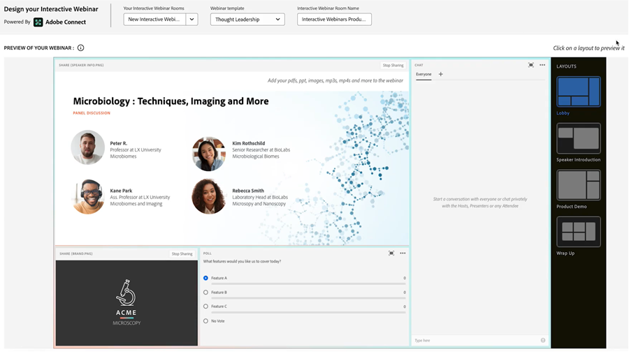

# Introduzione ai webinar interattivi {#get-started-with-interactive-webinars}

Hai letto la [Panoramica dei webinar interattivi](/help/marketo/product-docs/demand-generation/events/interactive-webinars/interactive-webinars-overview.md){target="_blank"}{target="_blank"} e sei pronto per iniziare. Per iniziare, segui la procedura riportata di seguito.

## Cosa fare {#what-to-do}

**Passaggio uno**: [Aggiungi utenti](/help/marketo/product-docs/demand-generation/events/interactive-webinars/user-and-license-management.md#add-a-user){target="_blank"} — Scopri come aggiungere (e in seguito rimuovere, se desiderato) utenti per l&#39;accesso ai webinar interattivi.

**Passaggio due**: [Crea un webinar interattivo](/help/marketo/product-docs/demand-generation/events/interactive-webinars/create-an-interactive-webinar.md){target="_blank"}{target="_blank"}. Scopri come creare un programma per eventi e impostare i parametri iniziali per il webinar.

**Passaggio tre (facoltativo)**: [Aggiungi un team di webinar](/help/marketo/product-docs/demand-generation/events/interactive-webinars/add-a-webinar-team.md){target="_blank"}{target="_blank"}. Se non intendi ospitare il webinar da solo, scopri come aggiungere relatori e co-host per condividere le funzioni di hosting/presentazione.

**Passaggio quattro**: [Progetta il webinar interattivo](/help/marketo/product-docs/demand-generation/events/interactive-webinars/designing-interactive-webinars.md){target="_blank"}. Dopo aver creato il webinar ed aggiunto un team opzionale, è ora di personalizzare l&#39;evento in base alle tue esigenze specifiche.

**Passaggio cinque**: [Promuovi il tuo webinar](/help/marketo/product-docs/demand-generation/events/interactive-webinars/promoting-an-interactive-webinar.md){target="_blank"}: scopri suggerimenti utili su come promuovere il tuo prossimo evento.

**Passaggio Sei**: [Distribuisci il webinar interattivo](/help/marketo/product-docs/demand-generation/events/interactive-webinars/deliver-an-interactive-webinar.md){target="_blank"} — Tutto ciò che devi sapere sulla presentazione del webinar.

Tutto qui!

## Documentazione aggiuntiva {#additional-documentation}

Al termine del webinar, scopri le sue prestazioni utilizzando l’utile dashboard nella schermata Panoramica dell’evento. Puoi vedere il coinvolgimento dettagliato del pubblico nella [dashboard di coinvolgimento](/help/marketo/product-docs/demand-generation/events/interactive-webinars/engagement-dashboard.md){target="_blank"}. Sfrutta il coinvolgimento del webinar per eseguire il targeting del pubblico in modo personalizzato utilizzando filtri avanzati e trigger in [Flussi di lavoro eventi](/help/marketo/product-docs/demand-generation/events/interactive-webinars/event-workflows.md){target="_blank"}. E scopri come tenere traccia delle prestazioni on-demand tramite [webinar on-demand](/help/marketo/product-docs/demand-generation/events/interactive-webinars/on-demand-webinars.md){target="_blank"}.

Su questo argomento sono disponibili altri articoli della Guida, tra cui [Best practice per i webinar interattivi](/help/marketo/product-docs/demand-generation/events/interactive-webinars/best-practices-for-interactive-webinars.md){target="_blank"}, come [personalizzare i webinar](/help/marketo/product-docs/demand-generation/events/interactive-webinars/customization.md){target="_blank"} in base alle proprie esigenze o al proprio marchio, come creare modelli a livello di organizzazione utilizzando [Modelli per i webinar interattivi](/help/marketo/product-docs/demand-generation/events/interactive-webinars/templates.md){target="_blank"} e come gestire le room e le registrazioni in [Room Management](/help/marketo/product-docs/demand-generation/events/interactive-webinars/room-management.md){target="_blank"}.

 

Divertiti a utilizzare i webinar interattivi (con tecnologia Adobe Connect).
