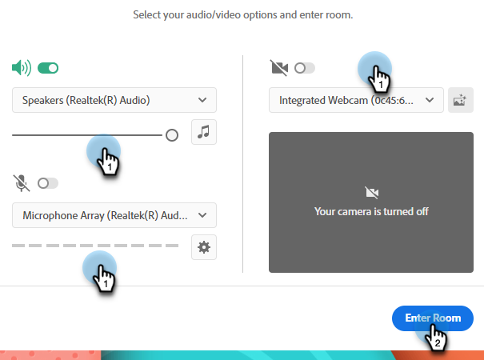
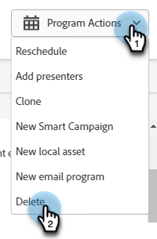

# Modificare o eliminare un webinar interattivo {#modify-or-delete-an-interactive-webinar}

Scopri come apportare modifiche al Webinar interattivo.

## Modificare un webinar interattivo {#modify-an-interactive-webinar}

1. Seleziona il programma eventi desiderato e fai clic su **Cambia stanza/modello**.

   

1. La stanza si caricherà. Se si desidera modificare la stanza, selezionarne una dal menu a discesa Stanze. Per aggiornare il modello, fai clic su **Sala d&#39;uso**.

   

>[!NOTE]
>
>La sostituzione della stanza è facoltativa e non è necessaria per aggiornare il modello.

1. Fai clic su **Migliora il tuo webinar ora**.

   

1. Seleziona le preferenze audio/video e fai clic su **Sala**.

   

1. Dopo aver apportato le modifiche, fai clic su **Sala di uscita**.

   

## Riprogrammazione di un webinar interattivo {#reschedule-an-interactive-webinar}

1. Seleziona il Programma eventi desiderato e fai clic sull’icona a forma di matita accanto alla data/ora attualmente pianificata.

   

1. Fai clic sull’icona del calendario, scegli la nuova data/ora e fai clic su **Salva**.

   

## Clona un webinar interattivo {#clone-an-interactive-webinar}

1. Selezionare il programma eventi desiderato.

   

1. Fai clic sul menu a discesa Azioni programma e seleziona **Clona**.

   

   >[!TIP]
   >
   >È inoltre possibile fare clic con il pulsante destro del mouse sul programma evento nella struttura e selezionare **Clona** da lì.

1. Assegna un nome al programma clonato, imposta l&#39;area di lavoro e la destinazione (se desideri che il programma viva in un altro luogo) e fai clic su **Salva**.

   

1. Fai clic su **Successivo**.

   

   >[!NOTE]
   >
   >Al momento è possibile salvare un Webinar interattivo clonato solo come Webinar interattivo. Salvataggio di un webinar clonato come Webinar partner (ad esempio, Zoom, ON24, ecc.) sarà disponibile a breve.

1. Scegli le impostazioni per il webinar clonato e fai clic su **Clona**.

   

## Eliminare un webinar interattivo {#delete-an-interactive-webinar}

1. Selezionare il programma eventi desiderato.

   

1. Fai clic sul menu a discesa Azioni programma e seleziona **Elimina**.

   

   >[!TIP]
   >
   >È inoltre possibile fare clic con il pulsante destro del mouse sul programma evento nella struttura e selezionare **Elimina** da lì.

1. Fai clic su **Elimina**.

   

   >[!IMPORTANT]
   >
   >Se nel programma sono presenti risorse locali, queste verranno eliminate.
