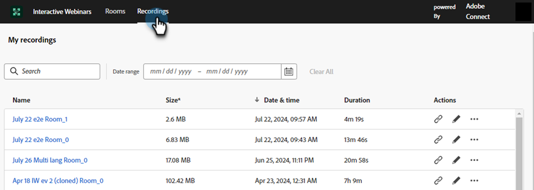

# Gestione della stanza {#room-management}

Le sale dei webinar interattivi basati su Adobe Connect sono progettate per facilitare gli eventi online coinvolgenti e collaborativi. Questi webinar memorizzano il contenuto e le registrazioni create e utilizzate durante il webinar. In qualità di membro con il diritto di creare una room, puoi accedervi e gestirli da una posizione centrale.

>[!NOTE]
>
>Puoi accedere solo alle chat che hai creato per un webinar e non alle chat di altri membri della tua organizzazione.

## Gestione e accesso a room e registrazioni {#manage-and-access-rooms-and-recordings}

1. Passare a **[!UICONTROL Design Studio]**.

   

1. Selezionare **[!UICONTROL Interactive Webinars]**, quindi **[!UICONTROL Manage Rooms]**.

   

### Camere {#rooms}

Una sala webinar interattiva è uno spazio virtuale progettato per ospitare eventi online live e coinvolgenti in cui i partecipanti possono interagire con il presentatore e altri partecipanti. In queste sale, puoi trovare i contenuti caricati e le registrazioni dei webinar.

Per visualizzare l&#39;elenco di tutte le tue room, seleziona **[!UICONTROL Rooms]** dalla barra dei menu superiore. Puoi trovare tutte le stanze che hai creato insieme al contenuto caricato e alle registrazioni in queste stanze. È inoltre possibile visualizzare il numero di registrazioni, la dimensione del file nella stanza e la data dell&#39;ultimo accesso per le rispettive stanze.

<table><tbody>
  <tr>
    <td><b>Registrazioni</td>
    <td>Visualizzare il numero di registrazioni disponibili in una stanza.</td>
  </tr>
  <tr>
    <td><b>Dimensione file in-room</td>
    <td>Consente di visualizzare le dimensioni file combinate del contenuto e delle registrazioni disponibili in una stanza.</td>
  </tr>
  <tr>
    <td><b>Ultimo accesso il</td>
    <td>Mostra la data dell'ultimo accesso alla room. Puoi ordinare le informazioni in base alla timeline.</td>
  </tr>
</tbody>
</table>

Da questa interfaccia centralizzata è possibile eseguire le azioni seguenti:

* Fai clic sull’icona Launch room per avviare e accedere alla room.
* Utilizza la barra di ricerca per trovare la stanza che stai cercando (cercherà solo le stanze che hai creato).
* Fare clic sull&#39;icona Elimina room per rimuovere la room. In questo modo verranno eliminate tutte le registrazioni e i file relativi alla room.

Quando si seleziona una room, è possibile visualizzare il contenuto o le registrazioni disponibili in tale room. In questa schermata, le informazioni sono disponibili in due schede: la scheda **Contenuto** e la scheda **Registrazioni**.

**Scheda Contenuto**

La scheda Contenuto consente di visualizzare i file caricati, il loro tipo, le dimensioni, la data dell’ultimo accesso e la data di caricamento.

<table><tbody>
  <tr>
    <td><b>Tipo</td>
    <td>Mostra il tipo di file, ad esempio PDF, JPG, PNG e così via.</td>
  </tr>
  <tr>
    <td><b>Dimensione</td>
    <td>Visualizza le dimensioni del file disponibile.</td>
  </tr>
  <tr>
    <td><b>Ultimo accesso il</td>
    <td>Mostra la data dell'ultimo accesso alla room. Puoi ordinare le informazioni in base alla timeline.</td>
  </tr>
  <tr>
    <td><b>Caricato</td>
    <td>Mostra quando il file è stato caricato.</td>
  </tr>
</tbody>
</table>

Nella scheda Contenuto è possibile eseguire le azioni seguenti:

* Fare clic sul pulsante **[!UICONTROL Launch room]** per avviare e accedere alla room.
* Usa la barra di ricerca per trovare il file che stai cercando.
* Fai clic sull’icona Scarica file per scaricare un file sul dispositivo. Selezionare due o più file da scaricare in blocco.
* Fare clic sull&#39;icona Elimina room per rimuovere la room. Quando un file viene eliminato, non può essere recuperato.
* Seleziona un file dal contenuto elencato per visualizzarlo sul dispositivo.

**Scheda Registrazioni**

La scheda Registrazioni consente di visualizzare tutte le registrazioni disponibili in questa room. Ogni registrazione viene visualizzata con dettagli quali dimensioni, data e ora di registrazione e durata.

Da questo hub centralizzato è possibile eseguire le azioni seguenti:

* Fare clic sul pulsante **[!UICONTROL Launch room]** per avviare e accedere alla room.
* Utilizzare la barra di ricerca per trovare la registrazione desiderata.
* Fai clic sull’icona Scarica file per scaricare un file sul dispositivo. Selezionare due o più file da scaricare in blocco.
* Fai clic sull’icona del collegamento Copia registrazione per copiare l’URL di registrazione.
* Fare clic sull&#39;icona Modifica registrazione per apportare modifiche alla registrazione.
* Fare clic sull&#39;icona Elimina per rimuovere la registrazione. Quando una registrazione viene eliminata, non può essere recuperata.
* Selezionare una registrazione per riprodurla sul dispositivo.

## Gestione e accesso alle registrazioni {#manage-and-access-recordings}

Le registrazioni sono risorse preziose che catturano l&#39;essenza delle discussioni in tempo reale, delle presentazioni e delle sessioni di domande e risposte. Consentono ai partecipanti di rivedere informazioni chiave, dettagli saltati o concetti complessi al proprio ritmo.

Fare clic sulla scheda **[!UICONTROL Recordings]** per visualizzare un elenco di tutte le registrazioni caricate.

In **[!UICONTROL My recordings]** è possibile trovare tutte le registrazioni disponibili nella room creata. È inoltre possibile visualizzarne le dimensioni, la data e l&#39;ora e la durata.

Da questo hub centralizzato è possibile eseguire le azioni seguenti:

* Utilizzare la barra di ricerca per trovare la registrazione desiderata. Puoi anche eseguire ricerche all’interno di una timeline selezionando un intervallo di date.
* Fai clic sull’icona del collegamento Copia registrazione per copiare l’URL di registrazione.
* Fare clic sull&#39;icona Modifica registrazione per apportare modifiche alla registrazione.
* Fare clic sull&#39;icona Mostra pagina collegata per visualizzare le informazioni sulla room in cui è disponibile la registrazione selezionata.
* Fare clic sull&#39;icona Elimina per rimuovere la registrazione. Quando una registrazione viene eliminata, non può essere recuperata.
* Selezionare una registrazione per riprodurla sul dispositivo.
