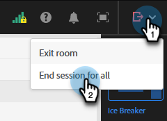

# Modelli per webinar interattivi {#templates-for-interactive-webinars}

Crea modelli facili da usare nei webinar interattivi per produrre contenuti più rapidamente e rimanere in linea con le linee guida del marchio quando lavori su un team.

## Concedere le autorizzazioni {#grant-permissions}

Prima che qualsiasi utente dell’organizzazione possa accedere ai modelli dei webinar interattivi, un amministratore di Marketo Engage deve innanzitutto aggiungere l’accesso ai ruoli desiderati.

1. In Marketo Engage fare clic su **[!UICONTROL Amministratore]**.

   

1. Fai clic su **[!UICONTROL Utenti e ruoli]**, quindi sulla scheda **[!UICONTROL Ruoli]**.

   

1. Fare doppio clic sul ruolo a cui si desidera aggiungere le autorizzazioni.

   

1. Fare clic per aprire **[!UICONTROL Access Design Studio]**.

   

1. Selezionare la casella di controllo **[!UICONTROL Accedi ai modelli di webinar interattivi]**.

   

## Creare un modello {#create-a-template}

1. In Marketo Engage fare clic su **[!UICONTROL Design Studio]**.

   

1. Fai clic su **[!UICONTROL Webinar interattivi]**.

   

1. Fare clic su **[!UICONTROL Gestisci modelli]**.

   

1. Viene visualizzata una nuova scheda. Fai clic su **Crea nuovo**.

   

1. Nella scheda Modelli standard, seleziona il modello desiderato e fai clic su **Avanti**.

   

   >[!NOTE]
   >
   >I modelli di organizzazione sono modelli già creati dall&#39;utente o dal team.

1. Immettere un nome e una descrizione. Fai clic su **Salva e apri**.

   

1. Viene visualizzata una nuova scheda. Per modificare o salvare il modello, è necessario accedere a una room. Poiché non si tratta di una vera e propria sala webinar, non è necessario effettuare selezioni audio/video. Fare clic su **Entra nella room**.

   

1. Apporta le modifiche desiderate al modello esistente.

   

1. Nel menu Esci in alto a destra, seleziona **Termina sessione per tutti**.

   

1. Fai clic su **Fine**.

   

Il modello viene salvato automaticamente.

## Modificare un modello {#edit-a-template}

Per modificare un modello esistente, effettua le seguenti operazioni.

1. In Marketo Engage fare clic su **[!UICONTROL Design Studio]**.

   

1. Fai clic su **[!UICONTROL Webinar interattivi]**.

   

1. Fare clic su **[!UICONTROL Gestisci modelli]**.

   

1. Viene visualizzata una nuova scheda. Individua il modello da modificare e fai clic sull’icona Apri.

   

1. Viene visualizzata una nuova scheda. Per modificare il modello, è necessario immettere una room. Poiché non si tratta di una vera e propria sala webinar, non è necessario effettuare selezioni audio/video. Fare clic su **Entra nella room**.

   

1. Apporta le modifiche desiderate al modello.

   

1. Nel menu Esci in alto a destra, seleziona **Termina sessione per tutti**.

   

1. Fai clic su **Fine**.

   

Le modifiche vengono salvate automaticamente.
