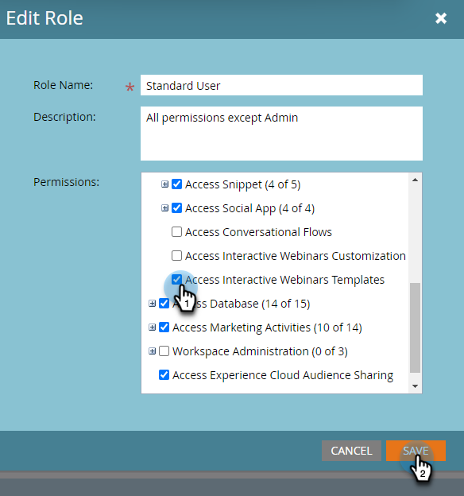

# Modelli per webinar interattivi {#templates-for-interactive-webinars}

Crea modelli facili da usare nei webinar interattivi per produrre contenuti più rapidamente e rimanere in linea con le linee guida del marchio quando lavori su un team.

## Creare un modello {#create-a-template}

1. In Marketo Engage fare clic su **[!UICONTROL Design Studio]**.

   

1. Fai clic su **[!UICONTROL Webinar interattivi]**.

   

1. Fare clic su **[!UICONTROL Gestisci modelli]**.

   

1. Viene visualizzata una nuova scheda. Fare clic su **Crea nuovo**.

   

1. Nella scheda Modelli standard, seleziona il modello desiderato e fai clic su **Avanti**.

   

   >[!NOTE]
   >
   >I modelli di organizzazione sono modelli già creati dall&#39;utente o dal team.

1. Immettere un nome e una descrizione. Fai clic su **Salva e apri**.

   

1. Viene visualizzata una nuova scheda. Per modificare o salvare il modello, è necessario accedere a una room. Poiché non si tratta di una vera e propria sala webinar, non è necessario effettuare selezioni audio/video. Fare clic su **Entra nella room**.

   

1. Apporta le modifiche desiderate al modello esistente.

   

1. Nel menu Esci in alto a destra, seleziona **Termina sessione per tutti**.

   

1. Fai clic su **Fine**.

   

Il modello viene salvato automaticamente.

## Modificare un modello {#edit-a-template}

Per modificare un modello esistente, effettua le seguenti operazioni.

1. In Marketo Engage fare clic su **[!UICONTROL Design Studio]**.

   

1. Fai clic su **[!UICONTROL Webinar interattivi]**.

   

1. Fare clic su **[!UICONTROL Gestisci modelli]**.

   

1. Viene visualizzata una nuova scheda. Individua il modello da modificare e fai clic sull’icona Apri.

   

1. Viene visualizzata una nuova scheda. Per modificare il modello, è necessario immettere una room. Poiché non si tratta di una vera e propria sala webinar, non è necessario effettuare selezioni audio/video. Fare clic su **Entra nella room**.

   

1. Apporta le modifiche desiderate al modello.

   

1. Nel menu Esci in alto a destra, seleziona **Termina sessione per tutti**.

   

1. Fai clic su **Fine**.

   

Le modifiche vengono salvate automaticamente.
