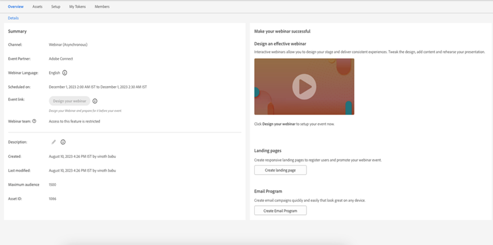

# Gestione di utenti e licenze {#user-and-license-management}

Scopri come aggiungere e rimuovere utenti e visualizzare le licenze correnti.

## Aggiungi un utente {#add-a-user}

1. Vai a **Amministratore** area.

   

1. Clic **Webinar interattivi**.

   

1. Clic **Aggiungi/Rimuovi utenti**.

   

1. Fai clic sul menu a discesa Utenti disponibili, seleziona gli utenti da aggiungere e fai clic su **OK**.

   

## Rimuovi un utente {#remove-a-user}

1. Vai a **Amministratore** area.

   

1. Clic **Webinar interattivi**.

   

1. Clic **Aggiungi/Rimuovi utenti**.

   

1. Evidenziare gli utenti che si desidera rimuovere e premere il tasto Canc sulla tastiera. Clic **OK** al termine.

   

## Utilizzo licenze {#license-usage}

I webinar interattivi offrono licenze specifiche per la creazione di eventi basati su Adobe Connect. Ogni volta che viene aggiunta una licenza, viene visualizzata una nuova casella di utilizzo della licenza. Gli amministratori di Marketo possono visualizzare (non modificare) le licenze seguendo la procedura riportata di seguito. Contatta l’Adobe Account Team (il tuo Account Manager) per ottenere ulteriori licenze.

1. Vai a **Amministratore** area.

   

1. Clic **Webinar interattivi**.

   

1. Scorri verso il basso fino alle schede Utilizzo licenze.

   

<table> 
  <tr> 
   <td><b>Data inizio</b></td>
   <td>Data di inizio della licenza.</td>
  </tr>
  <tr> 
   <td><b>Data di scadenza</b></td>
   <td>Data di scadenza della licenza.</td>
  </tr>
  <tr> 
   <td><b>Tipo</b></td>
   <td>Tipo di licenza acquistata. Sono disponibili tre tipi di licenza: Shared Events License, Shared Rooms License, Additional Storage License.</td>
  </tr>
  <tr> 
   <td><b>Capacità evento</b></td>
   <td>Il numero massimo di partecipanti che possono essere ospitati in un evento.</td>
  </tr>
  <tr> 
   <td><b>Eventi totali</b></td>
   <td>Numero totale di eventi per i quali è stato eseguito il provisioning con questa licenza.</td>
  </tr>
  <tr> 
   <td><b>Eventi utilizzati</b></td>
   <td>Numero totale di eventi completati.</td>
  </tr>
  <tr> 
   <td><b>Capacità di archiviazione</b></td>
   <td>Quantità di storage disponibile per l'archiviazione di registrazioni, materiale collaterale, heri images, documentazione e altre risorse.</td>
  </tr>
  </tbody>
</table>

**Aspetti da considerare**

* Il tipo &quot;Licenza di archiviazione aggiuntiva&quot; fornisce solo storage, pertanto il valore in ogni campo _oltre a_ La capacità di storage verrà elencata semplicemente come &quot;-&quot;.

* Il tipo &quot;Shared Room License&quot; ha eventi illimitati e &quot;Additional Storage License&quot; fornisce solo storage, pertanto il campo Total Events (Eventi totali) per queste licenze verrà elencato semplicemente come &quot;-&quot;.

* Ogni volta che un evento viene creato, verrà conteggiato come &quot;consumato&quot; dalla rispettiva licenza (a meno che non si tratti di una licenza per sala condivisa). La preferenza verrà data a &quot;Shared Event License&quot; se sono presenti sia &quot;Shared Event License&quot; che &quot;Shared Room License&quot; della stessa capacità. Se l&#39;evento non è stato consegnato e il programma eventi viene eliminato prima dell&#39;ora pianificata, il conteggio degli eventi viene rifornito sottraendo un evento dagli eventi consumati.

* Una volta esaurita la licenza, il riquadro rimane nella schermata Webinar interattivi della sezione Amministratore con &quot;Eventi totali&quot; e &quot;Eventi consumati&quot; che hanno lo stesso valore. La licenza verrà rimossa dalla schermata solo alla scadenza.

## Accesso utente {#user-access}

I webinar interattivi hanno la funzionalità di regolare l’utilizzo, consentendo agli utenti del Marketo Engage di creare e distribuire webinar interattivi. Tuttavia, un utente di un webinar interattivo (o non utente) potrebbe ancora avere accesso in lettura/modifica ai programmi di eventi di un webinar interattivo creati da altri utenti.

Gli utenti di Marketo che dispongono delle autorizzazioni per i webinar interattivi e sono proprietari di un particolare programma di eventi per webinar interattivi saranno in grado di eseguire tutte le funzioni del webinar interattivo relative a tale programma. Ciò include: creazione, accesso, modifica, clonazione, spostamento ed eliminazione del programma. Tuttavia, una volta che tale utente non è più un utente del webinar interattivo, il proprietario del programma sarebbe in grado di accedere al programma e spostarlo, ma non di eseguire altre funzioni.

Gli utenti di Marketo che hanno ricevuto l’autorizzazione per i webinar interattivi e sono _non_ I proprietari di un particolare programma di eventi di webinar interattivi sarebbero in grado di svolgere funzioni limitate su tali programmi. Gli utenti non amministratori di Marketo potranno accedere al programma e clonarlo, ma non potranno eseguire altre funzioni se dispongono delle autorizzazioni per i webinar interattivi. Tuttavia, gli utenti amministratore di Marketo _will_ essere in grado di eseguire tutte le funzioni, ad esempio accedere al programma, modificarlo, clonarlo, spostarlo ed eliminarlo, purché dispongano delle autorizzazioni per i webinar interattivi. Una volta revocata questa autorizzazione per gli utenti amministratori e non amministratori di Marketo, questi potranno solo accedere al Programma di eventi del webinar interattivo e non potranno eseguire altre funzioni.

La limitazione delle funzioni utilizzabili è indicata da un pulsante di azione disattivato e da un messaggio al passaggio del mouse. Alcuni esempi dei pulsanti di azione disattivati sono &quot;Progettare il webinar&quot; o &quot;Immettere il webinar&quot;. Per le funzioni non utilizzabili, viene fornito un messaggio che evidenzia le restrizioni. Vedi l’esempio seguente:

