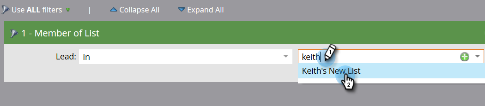

# Aggiunta di membri a un programma evento {#adding-members-to-an-event-program}

Questo articolo si applica solo agli utenti che utilizzano Event Cap o Obiettivi evento.

>[!CAUTION]
>
>L’importazione di un elenco di persone direttamente in un programma evento impedirà il conteggio di tali record nelle registrazioni effettive nel rapporto Tracciamento obiettivo e nel rapporto Progressione cap evento. Segui le istruzioni riportate di seguito per assicurarti che i tuoi documenti siano conteggiati.

1. Crea e [aggiungere persone a un elenco statico](/help/marketo/product-docs/core-marketo-concepts/smart-lists-and-static-lists/static-lists/create-a-static-list.md).

1. [Creare una campagna intelligente](/help/marketo/product-docs/core-marketo-concepts/smart-campaigns/creating-a-smart-campaign/create-a-new-smart-campaign.md).

1. Nell’elenco avanzato della campagna avanzata creata al passaggio 2, trova e aggiungi il **Membro dell&#39;elenco** filtro.

   

1. Individua e seleziona l’elenco creato al passaggio 1.

   

1. Nel Flusso, trova e aggiungi il **Cambia stato del programma** passaggio di flusso.

   

1. Trova e seleziona il programma eventi.

   

1. Scegli lo stato desiderato.

   

1. Nella scheda Pianificazione, fai clic su **Esegui una volta**.

   

1. Seleziona **Esegui ora** e fai clic su **Esegui**.

   

1. Una volta eseguita la campagna intelligente, i membri vengono aggiunti al programma e verranno conteggiati nei calcoli di Tracciamento obiettivo e Progressione cap evento.
