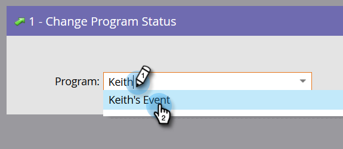

# Aggiunta di membri a un programma evento {#adding-members-to-an-event-program}

Questo articolo si applica solo agli utenti che utilizzano il limite degli eventi o gli obiettivi degli eventi.

>[!CAUTION]
>
>L’importazione di un elenco di persone direttamente in un programma di eventi impedisce che tali record vengano conteggiati nelle registrazioni effettive nel rapporto Tracciamento obiettivo e nel rapporto Progressione limite evento. Segui le istruzioni riportate di seguito per assicurarti che i tuoi dati vengano conteggiati.

1. Crea e [aggiungi persone a un elenco statico](/help/marketo/product-docs/core-marketo-concepts/smart-lists-and-static-lists/static-lists/create-a-static-list.md).

1. [Crea una campagna avanzata](/help/marketo/product-docs/core-marketo-concepts/smart-campaigns/creating-a-smart-campaign/create-a-new-smart-campaign.md).

1. Nell&#39;elenco avanzato della campagna avanzata creata nel passaggio due, trovare e aggiungere il filtro **[!UICONTROL Member of List]**.

   

1. Individuare e selezionare l&#39;elenco creato nel passaggio 1.

   

1. Nel flusso, trovare e aggiungere il passaggio di flusso **[!UICONTROL Change Program Status]**.

   

1. Trova e seleziona il programma dell’evento.

   

1. Scegli lo stato desiderato.

   

1. Nella scheda [!UICONTROL Schedule], fare clic su **[!UICONTROL Run Once]**.

   

1. Seleziona **[!UICONTROL Run Now]** e fai clic su **[!UICONTROL Run]**.

   

1. Dopo l’esecuzione della campagna intelligente, i membri vengono aggiunti al programma e vengono conteggiati nei calcoli di Tracciamento obiettivo e Progressione limite evento.
