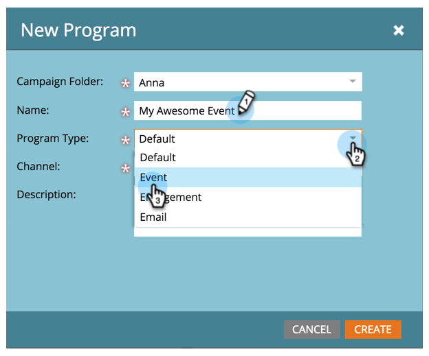

# Creare un nuovo programma evento {#create-a-new-event-program}

Gli eventi consentono di automatizzare gli eventi online e offline. Acquisisci lo stato delle persone mentre progrediscono in diverse fasi e ottieni misure precise del ROI per le iniziative di marketing.

1. Vai a **Attività di marketing**.

   

1. Selezionare la cartella del nuovo programma. Seleziona **Nuovo** e fai clic su **Nuovo programma**.

   

1. Scegli un nome per l’evento. Quindi, sotto **Tipo di programma**, seleziona **Evento**.

   

1. Seleziona una **Canale**.

   >[!NOTE]
   >
   >I canali definiscono i diversi stati che una persona può avere in un programma. Ulteriori informazioni [iscrizione al programma](/help/marketo/product-docs/core-marketo-concepts/programs/creating-programs/understanding-program-membership.md) qui.

   

1. Fai clic su **Crea**.

   

   Ta-da! Il nuovo evento verrà ora visualizzato nella struttura.

   

1. Per pianificare l’evento, seleziona **Vista a pianificazione** e fai clic su di esso nel calendario per aprire la finestra a comparsa. Inserisci date e ore.

   

1. Fai scorrere la barra fino a **Confermato** quando hai finito.

   

Una volta creato l’evento, genera il [pagine di destinazione](/help/marketo/product-docs/demand-generation/landing-pages/free-form-landing-pages/create-a-free-form-landing-page.md), [forms](/help/marketo/product-docs/demand-generation/forms/creating-a-form/create-a-form.md)e [e-mail](/help/marketo/product-docs/email-marketing/email-programs/creating-an-email-program/create-an-email-program.md) per invitare i vostri ospiti! Vuoi anche familiarizzare con il [vista programma](https://docs.marketo.com/display/docs/program+schedule+view).

>[!MORELIKETHIS]
>
>* [Calendario di marketing](/help/marketo/product-docs/core-marketo-concepts/marketing-calendar/understanding-the-calendar/navigating-the-marketing-calendar.md)
>* [Utilizzo dei costi del periodo in un programma](/help/marketo/product-docs/core-marketo-concepts/programs/working-with-programs/using-period-costs-in-a-program.md)

