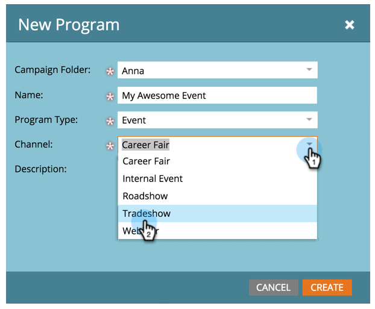

# Creare un nuovo programma evento {#create-a-new-event-program}

Eventi consente di automatizzare gli eventi online e offline. Acquisisci lo stato delle tue persone mentre avanzano attraverso diverse fasi e ottieni misurazioni accurate del ROI per le tue iniziative di marketing.

1. Vai a **Attività di marketing**.

   

1. Selezionare la cartella per il nuovo programma. Seleziona **Nuovo** e fai clic su **Nuovo programma**.

   

1. Scegli un nome per l’evento. Quindi, sotto **Tipo di programma**, seleziona **Evento**.

   

1. Seleziona un **Canale**.

   >[!NOTE]
   >
   >I canali definiscono i diversi stati di una persona in un programma. Ulteriori informazioni su [iscrizione al programma](/help/marketo/product-docs/core-marketo-concepts/programs/creating-programs/understanding-program-membership.md) qui.

   

1. Fai clic su **Crea**.

   

   Ta-da! Il nuovo evento verrà ora visualizzato nella struttura.

   

1. Per pianificare l’evento, seleziona **Vista Schedule** e fare clic su di esso nel calendario per aprire il popup. Inserire date e ore.

   

1. Scorri la barra fino a **Confermato** quando hai finito.

   

Una volta creato l’evento, crea il [pagine di destinazione](/help/marketo/product-docs/demand-generation/landing-pages/free-form-landing-pages/create-a-free-form-landing-page.md), [moduli](/help/marketo/product-docs/demand-generation/forms/creating-a-form/create-a-form.md), e [email](/help/marketo/product-docs/email-marketing/email-programs/creating-an-email-program/create-an-email-program.md) per invitare i vostri ospiti! È inoltre possibile acquisire familiarità con [visualizzazione pianificazione programmi](https://docs.marketo.com/display/docs/program+schedule+view).

>[!MORELIKETHIS]
>
>* [Calendario di marketing](/help/marketo/product-docs/core-marketo-concepts/marketing-calendar/understanding-the-calendar/navigating-the-marketing-calendar.md)
>* [Utilizzo dei costi del periodo in un programma](/help/marketo/product-docs/core-marketo-concepts/programs/working-with-programs/using-period-costs-in-a-program.md)
