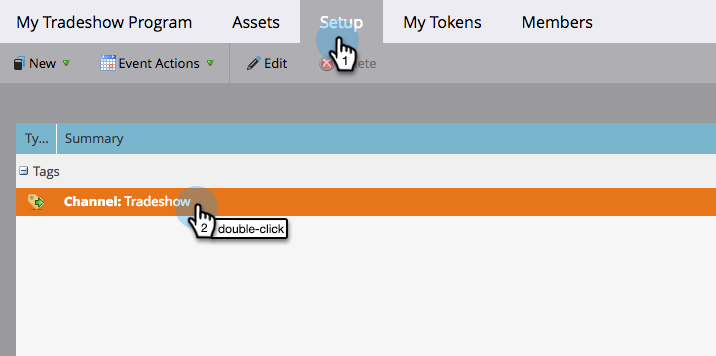

# Modificare un canale evento {#edit-an-event-channel}

Puoi modificare il tipo di canale da **Riepilogo** o dalla sua scheda **Configurazione** scheda .

>[!NOTE]
>
>Questa opzione è disponibile solo per gli eventi a cui non sono associati membri. Una volta che un evento dispone di membri, non è possibile modificare il tipo di canale.

>[!NOTE]
>
>Un programma è una specifica iniziativa di marketing. La **canale** è destinato a essere il meccanismo di consegna, come Webinar, Tradeshow o Online Ad. Puoi visualizzare diverse opzioni di canale nel menu a discesa, a seconda di ciò che è disponibile nella tua istanza. È inoltre possibile  [creare un canale personalizzato](/help/marketo/product-docs/administration/tags/create-a-program-channel.md).

## Dalla scheda Riepilogo {#from-the-summary-tab}

1. Da **Attività di marketing**, seleziona l’evento dalla struttura.

   

1. Passa a **Riepilogo** visualizza.

   

1. Sotto la **Impostazioni** selezionare la categoria corrente **Canale** visualizzato come collegamento ipertestuale.

   

1. Dall’elenco a discesa , seleziona un nuovo canale.

   

1. Fai clic su **Salva**.

   

## Dalla scheda Configurazione {#from-the-setup-tab}

È inoltre possibile assegnare un nuovo tipo di canale dal **Configurazione** scheda .

1. Seleziona l’evento dalla struttura.

   

1. Passa a **Configurazione** scheda . Fare doppio clic sulla **Canale**.

   

1. Seleziona un nuovo **Canale**.

   

1. Fai clic su **Salva**.

   

Congratulazioni! Hai appena modificato un canale!
