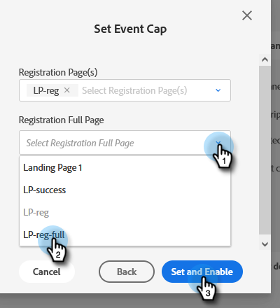

# Impostazione di un valore Cap per eventi {#setting-an-event-cap}

Limita la quantità di persone che possono registrarsi per l’evento con un limite massimo di eventi.

>[!NOTE]
>
>Non tutti i clienti hanno accesso a questa funzione. Contatta il tuo Customer Success Manager per i dettagli.

>[!IMPORTANT]
>È necessario disporre di almeno due pagine di destinazione approvate (una pagina di registrazione e una pagina di registrazione completa) nel programma prima di poter impostare un limite per l’evento.

>[!NOTE]
>
>Per liberare spazio in un evento, il membro del programma deve essere rimosso (è possibile farlo aggiornando il suo stato su &quot;Non in programma&quot;).

1. Selezionare il programma dell&#39;evento.

   

1. Nella panoramica , trova [!UICONTROL Event Cap] e fai clic su **[!UICONTROL Not Set]**.

   

1. Inserisci la quantità massima di persone che desideri registrare per l’evento e fai clic su **[!UICONTROL Next]**.

   

1. Fai clic sul pulsante [!UICONTROL Registration Page] e seleziona la pagina di destinazione che fungerà da pagina di registrazione.

   

1. Fai clic sul pulsante **[!UICONTROL Registration Full Page]** e seleziona la pagina di destinazione che fungerà da pagina completa della registrazione. Fai clic su **[!UICONTROL Set and Enable]** al termine.

   

   Siete tutti pronti. Per modificare i dettagli del limite dell’evento, fai clic sul testo blu accanto a [!UICONTROL Event Cap].

   
