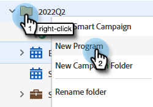
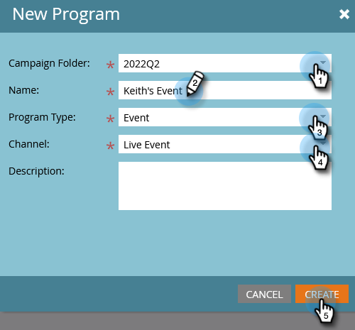
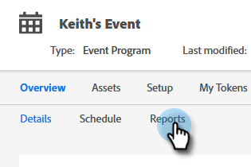
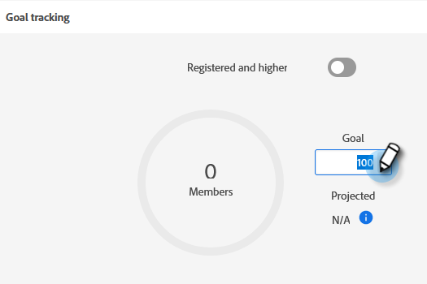

# Impostazione degli obiettivi evento {#setting-event-goals}

Assegna agli eventi obiettivi specifici e ne osserva le prestazioni.

>[!IMPORTANT]
>
>Non tutti hanno acquistato questa funzione. Per ulteriori informazioni, contatta il team dell’account di Adobe (il tuo Account Manager).

1. Crea un programma di eventi.

   

1. Scegli [!UICONTROL Campaign Folder], assegna all&#39;evento un [!UICONTROL Name], seleziona [!UICONTROL Program Type] e [!UICONTROL Channel]. Al termine, fai clic su **[!UICONTROL Create]**.

   

1. Nel tuo evento, fai clic sulla scheda **[!UICONTROL Reports]**.

   

1. Immettere l&#39;obiettivo per [!UICONTROL Registered] facendo clic su **[!UICONTROL Set a goal]**. Digita il numero in e premi Invio.

   

   

1. Ripetere gli stessi passaggi per [!UICONTROL Attended].

   

>[!NOTE]
>
>Non puoi impostare gli obiettivi per un evento dopo il suo avvio.

Controllare lo stato dell&#39;obiettivo dell&#39;evento facendo clic sulla scheda [!UICONTROL Reports].
