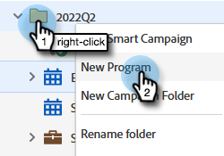

# Impostazione degli obiettivi evento {#setting-event-goals}

Assegna agli eventi obiettivi specifici e ne osserva le prestazioni.

>[!IMPORTANT]
>
>Non tutti hanno acquistato questa funzione. Per ulteriori informazioni, contatta l’Adobe Account Team (il tuo Account Manager).

1. Crea un programma di eventi.

   

1. Scegli la [!UICONTROL Cartella campagna], assegna all’evento un [!UICONTROL Nome], seleziona la [!UICONTROL Tipo di programma] e [!UICONTROL Canale]. Clic **[!UICONTROL Crea]** al termine.

   

1. Nell’evento, fai clic su **[!UICONTROL Rapporti]** scheda.

   

1. Immetti l’obiettivo per [!UICONTROL Registrato] facendo clic su **[!UICONTROL Imposta un obiettivo]**. Digita il numero in e premi Invio.

   

   

1. Ripeti gli stessi passaggi per [!UICONTROL Partecipazione avvenuta].

   

>[!NOTE]
>
>Non puoi impostare gli obiettivi per un evento dopo il suo avvio.

Ed è tutto! Controlla lo stato dell’obiettivo dell’evento facendo clic sul pulsante [!UICONTROL Rapporti] scheda.
