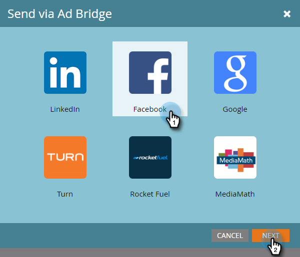

# Aggiungere lead a un pubblico personalizzato in Facebook {#add-leads-to-a-custom-audience-in-facebook}

Hai già un pubblico personalizzato in Facebook e desideri aggiungervi altri lead? Ecco come.

>[!PREREQUISITES]
>
>* [Creare un pubblico personalizzato in Facebook](/help/marketo/product-docs/demand-generation/facebook/create-a-custom-audience-in-facebook.md)
>* [Accettare i termini dei tipi di pubblico personalizzati di Facebook](https://www.facebook.com/ads/manage/customaudiences/tos.php) nel tuo account Facebook.
>

1. Trova e seleziona l’elenco smart o statico contenente i lead da aggiungere.

   

1. Seleziona la **Lead** , quindi fare clic sul pulsante **Invia tramite Ad Bridge** nella parte inferiore.

   

1. Seleziona **Facebook** e fai clic su **Successivo**.

   

1. Fai clic su **Pubblico** , seleziona il pubblico a cui desideri aggiungere i lead e fai clic su **Aggiorna**.

   

   >[!NOTE]
   >
   >**Aggiungere lead al pubblico**: saranno disponibili solo i tipi di pubblico di Facebook con un sottotipo personalizzato.\
   >**Rimuovi lead dal pubblico**: rimuove i lead dall’elenco statico o avanzato da un pubblico di Facebook.

1. Al termine, lo stato viene aggiornato.

   

   È tutto qui!

   >[!NOTE]
   >
   >[Creare un pubblico personalizzato in Facebook](/help/marketo/product-docs/demand-generation/facebook/create-a-custom-audience-in-facebook.md)
