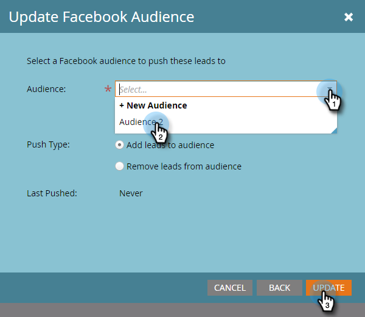

# Aggiungi lead a un pubblico personalizzato in [!DNL Facebook] {#add-leads-to-a-custom-audience-in-facebook}

Hai già un pubblico personalizzato in [!DNL Facebook] e vuoi aggiungervi altri lead? Ecco come.

>[!PREREQUISITES]
>
>* [Crea un pubblico personalizzato in [!DNL Facebook]](/help/marketo/product-docs/demand-generation/facebook/create-a-custom-audience-in-facebook.md)
>* [Accetta i termini dei tipi di pubblico personalizzati di  [!DNL Facebook]](https://www.facebook.com/ads/manage/customaudiences/tos.php) nel tuo account [!DNL Facebook].
>

1. Trova e seleziona l’elenco smart o statico contenente i lead da aggiungere.

   

1. Seleziona la scheda **[!UICONTROL Leads]**, quindi fai clic sull&#39;icona **Invia tramite Ad Bridge** in basso.

   

1. Selezionare **[!UICONTROL Facebook]** e fare clic su **[!UICONTROL Next]**.

   

1. Fare clic sull&#39;elenco a discesa **[!UICONTROL Audience]**, selezionare il pubblico a cui si desidera aggiungere i lead, quindi fare clic su **[!UICONTROL Update]**.

   

   >[!NOTE]
   >
   >**[!UICONTROL Add leads to audience]**: saranno disponibili solo [!DNL Facebook] tipi di pubblico con un sottotipo personalizzato.\
   >**[!UICONTROL Remove leads from audience]**: rimuove i lead nell&#39;elenco statico o smart da un pubblico [!DNL Facebook].

1. Al termine, lo stato viene aggiornato.

   

   È tutto qui!

   >[!NOTE]
   >
   >[Crea un pubblico personalizzato in [!DNL Facebook]](/help/marketo/product-docs/demand-generation/facebook/create-a-custom-audience-in-facebook.md)
