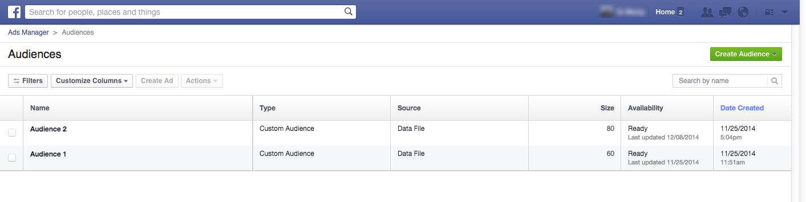

# Creare un pubblico personalizzato in Facebook {#create-a-custom-audience-in-facebook}

>[!NOTE]
>
>**Prerequisiti**
>
>* [Aggiungi pubblico personalizzato Facebook come servizio](../../../product-docs/demand-generation/ad-network-integrations/add-facebook-custom-audiences-as-a-launchpoint-service.md) LaunchPoint nella sezione Admin.
>* [Accettate i Termini](https://www.facebook.com/ads/manage/customaudiences/tos.php) di audience personalizzati di Facebook nel vostro account Facebook.

>

>[!TIP]
>
>Ulteriori informazioni sui tipi di pubblico [personalizzati in Facebook](https://www.facebook.com/help/341425252616329).

1. Individuate e selezionate l&#39;elenco statico o avanzato che contiene i lead da cui desiderate creare l&#39;audience.

   

1. Selezionate la scheda **Lead** , quindi fate clic sull&#39;icona **Send Via Ad Bridge **nella parte inferiore.

   

1. Selezionare **Facebook **e fare clic su **Avanti**.

   

1. Fai clic sul menu a discesa **Audience** e seleziona **+ Nuovo pubblico**.

   

1. Digita un nome **di** audience. Fate clic su **Aggiorna**.

   

   >[!NOTE]
   >
   >Se disponete di più account di annunci Facebook, vedrete un ulteriore elenco a discesa, che vi consentirà di scegliere in quale account di annuncio viene creato questo pubblico.

   >[!TIP]
   >
   >Vuoi scambiare una nuova audience con una esistente attualmente associata a un set di annunci o a un gruppo? Selezionate la casella di controllo **Sostituisci un&#39;audience** esistente. In questo modo **non** verrà eliminato il pubblico in fase di sostituzione.

1. Al termine, la finestra di dialogo dello stato verrà aggiornata.

   

   Ed è tutto! In Facebook troverai la nuova audience in **Ads Manager > Audiences**.

   

   >[!NOTE]
   >
   >Tutti gli elenchi trasmessi a Facebook diventano statici. Gli elenchi avanzati di Marketo non aggiorneranno automaticamente l&#39;elenco delle audience in Facebook per riflettere eventuali modifiche apportate dopo il trasferimento.

   >[!TIP]
   >
   >Consulta il percorso di apprendimento di [Facebook per i clienti](https://facebook.exceedlms.com/student/enrollments/create_enrollment_from_token/BF9TqSaCvM73PP4ScjhCm4fi)Marketo. Copre tutto ciò che devi sapere, dalla creazione di una pagina Facebook al targeting delle tue pubblicità Facebook tramite le integrazioni di rete pubblicitarie di Marketo.

   >[!NOTE]
   >
   >**Articoli correlati**
   >
   >    
   >    
   >    * [Aggiunta di lead a un pubblico personalizzato in Facebook](add-leads-to-a-custom-audience-in-facebook.md)

