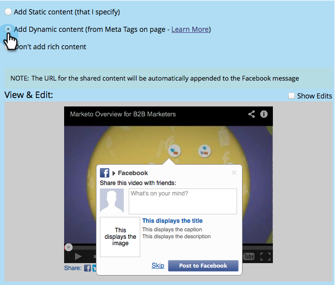

# Modifica impostazioni Facebook Rich Post {#edit-facebook-rich-post-settings}

Personalizza i post quando gli utenti ti condividono su Facebook.

>[!AVAILABILITY]
>
>Questa funzionalità non è stata acquistata da tutti i clienti. Per ulteriori informazioni, contatta il tuo rappresentante commerciale.

Marketo [app social](/help/marketo/product-docs/demand-generation/social/social-functions/add-a-social-button-on-a-landing-page.md) consenti ai lead di condividere le pagine di destinazione con le loro connessioni su social network come Facebook, Twitter, ecc. I tag di facebook OpenGraph (tag OG) consentono di specificare quali informazioni della pagina di destinazione vengono incluse nei post di Facebook.

## Seleziona opzioni post formattato {#select-rich-post-options}

Puoi specificare i tipi di informazioni di pagina da utilizzare nei post avanzati di Facebook generati dalle condivisioni dalla pagina di destinazione.

1. Seleziona **Messaggio facebook** nell’editor per il tuo **YouTube** pulsante video o social.

   

1. Seleziona tra le seguenti opzioni per il messaggio Facebook.

   * Aggiungi contenuto statico: seleziona questa opzione per inserire manualmente il titolo, la didascalia e la descrizione.

   

   * Aggiungi contenuto dinamico: la tua app social può utilizzare i `<TITLE>`, `<CAPTION>`, e `<DESCRIPTION>` per compilare il post RTF.

   

   >[!NOTE]
   >
   >Questi dovrebbero già esistere nell’origine della pagina, ma per un maggiore controllo, puoi aggiungere specifici tag Facebook OG alla pagina di destinazione.

   * Non aggiungere contenuti avanzati: limita i post di Facebook dalla pagina di destinazione al solo messaggio principale e collegamento.

   

## Aggiungere tag Facebook OG a una pagina di destinazione {#add-facebook-og-tags-to-a-landing-page}

Per controllare gli elementi della pagina che verranno inclusi nelle condivisioni Facebook dalla pagina di destinazione, puoi aggiungere alla pagina di destinazione i tag Facebook OG (Open Graph) per titolo, didascalia e descrizione.

1. Apri la pagina di destinazione contenente il **Video su YouTube** o pulsante social.

   

   Il **Progettazione pagina di destinazione** si apre in una nuova finestra.

1. Seleziona **Azioni pagina di destinazione** > **Modifica metatag pagina**.

   

1. Aggiungete il HTML che definisce og:title, og:caption e og:description. Copiare e incollare queste righe e sostituire il testo segnaposto:

   `<meta property="og:title" content="My Post Title"/>`

   `<meta property="og:caption" content="My Post Caption"/>`

   `<meta property="og:description" content="This text appears in the post description"/>`

   

>[!NOTE]
>
>Presta attenzione a utilizzare la sintassi HTML corretta quando aggiungi i tag OG.
