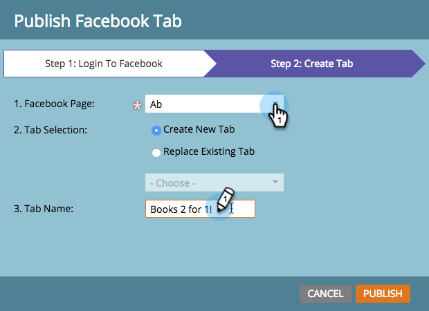

# Pubblica pagine di destinazione in [!DNL Facebook] {#publish-landing-pages-to-facebook}

Puoi pubblicare le pagine di destinazione in [!DNL Facebook], incontrare il pubblico in cui si trovano e generare più traffico per i tuoi programmi.

>[!AVAILABILITY]
>
>SMB Spark, Standard e Select. Enterprise con funzionalità con licenza separata.

>[!PREREQUISITES]
>
>La pagina deve avere almeno 2.000 Mi piace prima di poter pubblicare su [!DNL Facebook].

Se stai lanciando un nuovo libro, potresti raggiungere parte del tuo pubblico tramite e-mail e sito web. La pubblicazione di una pagina di destinazione di Marketo in aggiunta alla pagina del marchio [!DNL Facebook] raggiunge un pubblico più ampio e incoraggia la condivisione della tua offerta.

1. Seleziona una pagina di destinazione approvata.

   

1. Selezionare **[!UICONTROL Publish to Facebook]** dalle azioni della pagina di destinazione.

   

   >[!NOTE]
   >
   >Questa tecnica consente di pubblicare la pagina di destinazione in un&#39;app [!DNL Facebook] (precedentemente nota come scheda [!DNL Facebook]). Poiché le app [!DNL Facebook] non sono disponibili su dispositivi mobili, questa tecnica non funzionerà quando il visitatore tenta di accedere alla pagina di destinazione pubblicata su un&#39;app [!DNL Facebook] su un dispositivo mobile.

1. Autorizza Marketo a pubblicare sulla tua pagina [!DNL Facebook].

   

1. Immetti le tue credenziali di [!DNL Facebook].

   

   >[!NOTE]
   >
   >Sarà necessario utilizzare un account con autorizzazioni di amministratore per la pagina [!DNL Facebook] su cui si desidera pubblicare la pagina di destinazione di Marketo.

1. Selezionare **[!UICONTROL Facebook Page]** in cui si desidera pubblicare la pagina di destinazione e immettere il nome da utilizzare per visualizzare la pagina di destinazione di Marketo.

   

   >[!NOTE]
   >
   >Per sostituire le pagine di destinazione di Marketo pubblicate in precedenza in [!DNL Facebook], selezionare **[!UICONTROL Replace Existing Tab]** e scegliere la scheda da sostituire dall&#39;elenco a discesa. Tieni presente che queste non sostituiranno le schede non Marketo.

1. I lead possono ora visitare la pagina di destinazione direttamente sulla pagina [!DNL Facebook]. Fai clic sul nome della scheda sotto l’immagine di copertina.

   

   >[!NOTE]
   >
   >Per rimuovere la pagina di destinazione da [!DNL Facebook], annullare l&#39;approvazione in Marketo e, quando richiesto, selezionare l&#39;opzione per rimuovere la scheda [!DNL Facebook].
