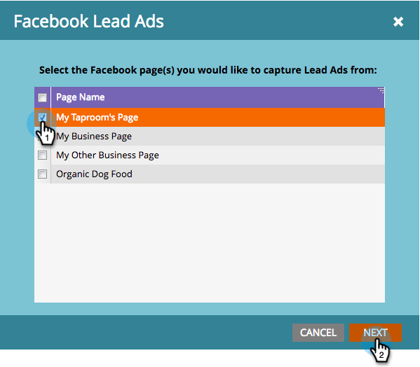

# Configurare i lead sponsorizzati su Facebook {#set-up-facebook-lead-ads}

Utilizza [Facebook Lead Ads](https://www.facebook.com/business/ads/ad-objectives/lead-generation){target="_blank"} per eseguire campagne pubblicitarie su Facebook e generare lead per Marketo.

>[!NOTE]
>
>**Autorizzazioni amministratore richieste**

>[!AVAILABILITY]
>
>Per aggiungere i lead Ads di Facebook alla tua istanza, contatta il team dell’account di Adobe (il tuo Account Manager).

1. In Marketo Engage, vai all&#39;area **Amministratore**.

   

1. Vai a **LaunchPoint**, fai clic sull&#39;elenco a discesa **New** e seleziona **New Service**.

   

1. Immetti **[!UICONTROL Display Name]** per il servizio, seleziona il servizio **[!UICONTROL Facebook Lead Ads]** dal menu a discesa e fai clic su **[!UICONTROL Create]**.

   

1. Apri una nuova scheda nello stesso browser e passa a [facebook.com](https://www.facebook.com){target="_blank"}. Accedi a Facebook utilizzando l’account che desideri utilizzare per l’integrazione.

   >[!NOTE]
   >
   >L&#39;account [!DNL Facebook] dovrà accedere a tutte le pagine aziendali [!DNL Facebook] da cui desideri richiamare annunci lead.

   

1. Dopo aver effettuato l&#39;accesso a [!DNL Facebook], tornare a Marketo e fare clic su **[!UICONTROL Authorize]**.

   

1. Se richiesto, fare clic su **[!UICONTROL OK]** per accettare l&#39;installazione dell&#39;app Marketo in [!DNL Facebook].

   

1. Noterai che ora sei autorizzato. Fai clic su **[!UICONTROL Next]**.

   

1. Selezionare le pagine da cui Marketo dovrà richiamare [!UICONTROL Facebook Lead Ads] e fare clic su **[!UICONTROL Next]**.

   >[!TIP]
   >
   >Se non trovi una pagina prevista, accertati che l&#39;account [!DNL Facebook] utilizzato per l&#39;autenticazione sia aggiunto alla pagina in [!DNL Facebook] e riprova.

   

1. Per accettare le mappature predefinite dei campi da [!DNL Facebook] a Marketo, fare clic su **[!UICONTROL Create]**.

   >[!TIP]
   >
   >Modificando le mappature, puoi personalizzare la posizione in cui vengono memorizzati i dati degli annunci lead in Marketo. Puoi anche [estrarre i dati dalle domande personalizzate sui lead ads](/help/marketo/product-docs/demand-generation/facebook/set-up-facebook-lead-ads/map-custom-fields-to-marketo.md){target="_blank"}.

   >[!CAUTION]
   >
   >Marketo non supporta la mappatura di due campi [!DNL Facebook] in un singolo campo Marketo, solo da 1 a 1. Se si esegue il mapping da 2 a 1, i lead potrebbero non essere in grado di accedere al sistema Marketo.

   

   Ben fatto! I lead inizieranno a fluire in Marketo quando si eseguono con successo [!DNL Facebook] campagne di annunci lead.

   

>[!MORELIKETHIS]
>
>* [Assegna/Rimuovi autorizzazioni in Gestione accesso lead (Facebook)](https://www.facebook.com/business/help/540596413257598?id=735435806665862){target="_blank"}
>* [Utilizzare filtri e trigger di annunci lead in una campagna avanzata](/help/marketo/product-docs/demand-generation/facebook/use-lead-ads-filters-and-triggers-in-a-smart-campaign.md){target="_blank"}
>* [Mappa campi personalizzati su Marketo](/help/marketo/product-docs/demand-generation/facebook/set-up-facebook-lead-ads/map-custom-fields-to-marketo.md){target="_blank"}
