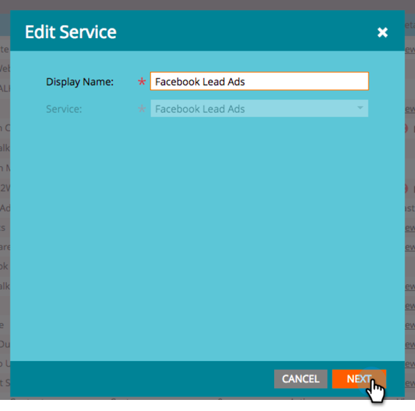
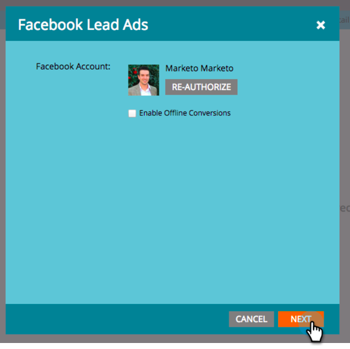

# Mappa campi personalizzati su Marketo {#map-custom-fields-to-marketo}

Per impostazione predefinita, è possibile che si desideri raccogliere più informazioni rispetto a quelle standard archiviate in [!DNL Facebook], ad esempio la frequenza con cui un utente utilizza il servizio di consegna online. Puoi eseguire questa operazione [creando domande personalizzate](https://www.facebook.com/business/help/774623835981457?helpref=uf_permalink) nei tuoi [!DNL Facebook] annunci lead.

Tuttavia, **Marketo non inizierà automaticamente a raccogliere questi dati**. Affinché Marketo possa iniziare a catturare i valori dei campi personalizzati, **devi** mappare tali campi personalizzati a un campo in Marketo.

Segui questi passaggi per effettuare questa configurazione nell’area LaunchPoint di Admin.

>[!NOTE]
>
>**Autorizzazioni amministratore richieste**

1. Passare all&#39;area di amministrazione e fare clic su **[!UICONTROL LaunchPoint]**. In Servizi installati, trovare e modificare **[!UICONTROL Facebook Lead Ads]**.

   

1. Fare clic su **[!UICONTROL Next]**.

   

1. Lascia invariato l&#39;account autorizzato, **non** apporta modifiche. Fare clic su **[!UICONTROL Next]**.

   

1. Come prima, lascia invariate le pagine selezionate, **non** apporta modifiche. Fare clic su **[!UICONTROL Next]**.

   

1. Mappa il campo [!DNL Facebook] personalizzato sul tuo campo Marketo. Fare clic su **[!UICONTROL Add].**

   

1. Nella nuova riga, immettere il nome del campo personalizzato [!DNL Facebook].

   

   >[!NOTE]
   >
   >Solo i campi salvati nei modelli di modulo [!DNL Facebook] verranno visualizzati come opzioni qui.

1. Fare clic nella colonna **[!UICONTROL Marketo Field]**. Digitare per cercare il campo a cui si desidera eseguire il mapping. Dopo aver selezionato un campo, fare clic su **[!UICONTROL Save]**.

   

   >[!NOTE]
   >
   >Se non disponi già di un campo in Marketo a cui mappare il campo [!DNL Facebook], scopri come [creare campi personalizzati](/help/marketo/product-docs/administration/field-management/create-a-custom-field-in-marketo.md).

>[!CAUTION]
>
>Per consentire a Marketo di raccogliere i dati, **devi** eseguire questa procedura per qualsiasi nuovo campo [!DNL Facebook].
