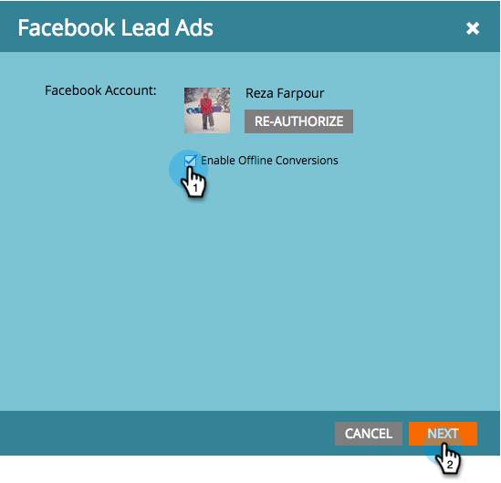
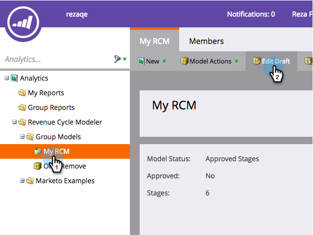
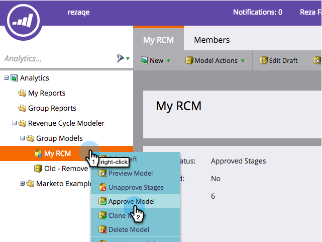

# Configura [!DNL Facebook] conversioni offline {#set-up-facebook-offline-conversions}

Inviando di nuovo i dati di conversione offline a [!DNL Facebook] per le persone create tramite annunci lead, il tuo team pubblicitario può ottimizzare la spesa pubblicitaria meglio che mai. Segui questi passaggi per configurarlo.

>[!PREREQUISITES]
>
>Devi [configurare i lead Ads di Facebook](/help/marketo/product-docs/demand-generation/facebook/set-up-facebook-lead-ads.md).

## Configurazione amministratore {#admin-configuration}

1. Passare a Marketo **[!UICONTROL Admin]**.

   

1. Vai a **[!UICONTROL LaunchPoint]** e fai doppio clic sul servizio Annunci lead di Facebook creato in precedenza.

   >[!NOTE]
   >
   >Se non l&#39;hai ancora fatto, [Configura [!UICONTROL Facebook Lead Ads]](/help/marketo/product-docs/demand-generation/facebook/set-up-facebook-lead-ads.md), quindi torna qui.

   

1. Se lo desideri, modifica **[!UICONTROL Display Name]** per includere le conversioni offline. Fai clic su **[!UICONTROL Next]**.

   

1. Selezionare **[!UICONTROL Enable Offline Conversions]** e fare clic su **[!UICONTROL Next]**.

   

1. Fai clic su **[!UICONTROL Next]**.

   

1. Fai clic su **[!UICONTROL Save]**.

   

   È stata completata l&#39;attivazione di [!DNL Facebook] conversioni offline. Procedi alla Modeler Ciclo ricavi per mappare le fasi.

   

## Configurazione Modeler del ciclo dei ricavi {#revenue-cycle-modeler-configuration}

1. Passa a **[!UICONTROL Analytics]**.

   

1. Selezionare il modello e fare clic su **[!UICONTROL Edit Draft]**.

   

   >[!NOTE]
   >
   >Attualmente, sono presenti 10 [!DNL Facebook] eventi a cui è possibile mappare le fasi del ciclo dei ricavi:
   >
   >* Aggiunte di informazioni di pagamento
   >* Aggiunte al carrello
   >* Aggiunte alla lista dei desideri
   >* Registrazioni completate
   >* Pagamenti avviati
   >* Persona
   >* Altro
   >* Acquisto
   >* Ricerche
   >* Visualizzazioni contenuto

1. Selezionare la fase da mappare, quindi dal menu a discesa **[!UICONTROL Facebook Conversion]** selezionare l&#39;evento [!DNL Facebook] a cui si desidera mappare l&#39;evento. Ripetere questo passaggio per mappare tutte le fasi di RCM alle fasi di conversione offline in [!DNL Facebook].

   

1. Al termine della mappatura, chiudete il modello.

   

1. Approva il modello e hai terminato.

   

   Ora, quando i lead ad raggiungono le fasi mappate, le conversioni vengono inviate a [!DNL Facebook] per il reporting.

   >[!CAUTION]
   >
   >Controlla il tuo account [!DNL Facebook] e assicurati che tutti gli [annunci siano associati](https://www.facebook.com/business/url/?href=%2Fbusiness%2Fhelp%2Fwww%2F1776828022605281&cmsid&creative=link&creative_detail=advertiser-help-center&create_type&destination_cms_id&orig_http_referrer) al set di eventi per conversioni offline di Marketo. In caso contrario, l’attribuzione potrebbe non funzionare.

   >[!NOTE]
   >
   >I dati di conversione offline vengono inviati da Marketo a [!DNL Facebook] diverse volte al giorno.

>[!MORELIKETHIS]
>
>[Informazioni [!DNL Facebook] Sulle Conversioni Offline](/help/marketo/product-docs/demand-generation/facebook/understanding-facebook-offline-conversions.md)
