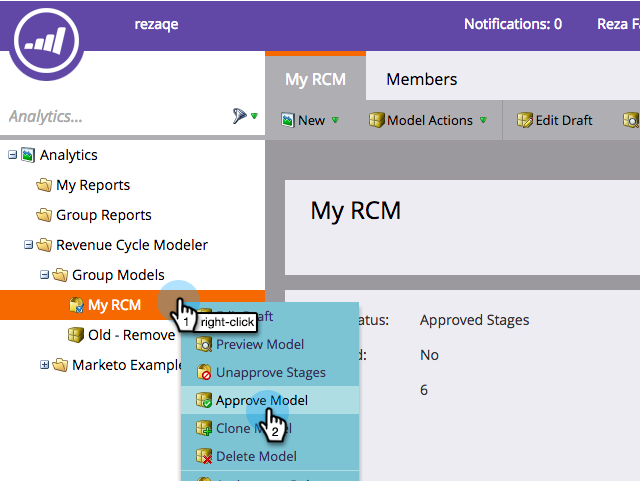

# Configurare le conversioni offline di Facebook {#set-up-facebook-offline-conversions}

Inviando dati di conversione offline a Facebook per le persone create tramite gli annunci lead, il team pubblicitario può ottimizzare la spesa pubblicitaria in modo migliore che mai. Ecco come impostarlo.

>[!PREREQUISITES]
>
>* È necessario [impostare Facebook Lead Ads](/help/marketo/product-docs/demand-generation/facebook/set-up-facebook-lead-ads.md).
>* È necessario disporre di un modello approvato in [Modellatore ciclo ricavi](/help/marketo/product-docs/reporting/revenue-cycle-analytics/revenue-cycle-models/understanding-revenue-models.md).

## Configurazione amministratore {#admin-configuration}

1. Vai a Marketo **Admin**.

   

1. Accedete a **LaunchPoint** e fate doppio clic sul servizio Annunci lead di Facebook creato in precedenza.

   >[!NOTE]
   >
   >Se non l&#39;hai ancora fatto, vai avanti e [configura gli annunci lead Facebook](/help/marketo/product-docs/demand-generation/facebook/set-up-facebook-lead-ads.md), quindi torna qui.

   

1. Se lo desiderate, modificate il **Nome visualizzato** per includere le conversioni offline. Fare clic su **Next**.

   

1. Selezionare **Abilita conversioni offline** e fare clic su **Next**.

   

1. Fare clic su **Next**.

   

1. Fare clic su **Salva**.

   

   Dolce! L&#39;attivazione delle conversioni offline di Facebook è stata completata a metà. Andiamo al Modellatore del ciclo delle entrate per mappare le fasi.

   

## Configurazione del modello del ciclo delle entrate {#revenue-cycle-modeler-configuration}

1. Vai a **Analytics**.

   

1. Selezionare il modello e fare clic su **Modifica bozza**.

   

   >[!NOTE]
   >
   >Attualmente, sono disponibili 10 eventi Facebook per mappare le fasi del ciclo di ricavi su:
   >
   >* Aggiungi informazioni di pagamento
   >* Aggiungi al carrello
   >* Aggiunge all&#39;elenco dei desideri
   >* Registrazioni completate
   >* Checkout avviati
   >* Person
   >* Altro
   >* Purchase
   >* Ricerche
   >* Visualizzazioni contenuto

1. Selezionate il passaggio da mappare, quindi dal menu a discesa **Conversione Facebook** selezionate l&#39;evento Facebook a cui desiderate mappare. Ripetete questo passaggio per mappare tutti gli stadi di RCM sulle fasi di conversione offline di Facebook.

   

1. Al termine della mappatura, chiudere il modello.

   

1. Approva il tuo modello e hai finito!

   

   Ora, quando i lead Lead Ad raggiungono le fasi mappate, le conversioni vengono inviate a Facebook per generare report.

   >[!CAUTION]
   >
   >Controllate l&#39;account Facebook e accertatevi che tutti gli [annunci siano associati](https://www.facebook.com/business/url/?href=%2Fbusiness%2Fhelp%2Fwww%2F1776828022605281&amp;cmsid&amp;creative=link&amp;creative_detail=advertiser-help-center&amp;create_type&amp;destination_cms_id&amp;orig_http_referrer) al set di eventi di conversione offline di Marketo. In caso contrario, l&#39;attribuzione degli annunci potrebbe non funzionare.

   >[!NOTE]
   >
   >I dati di conversione offline vengono inviati da Marketo a Facebook più volte al giorno.

>[!MORELIKETHIS]
>
>[Informazioni sulle conversioni offline di Facebook](/help/marketo/product-docs/demand-generation/facebook/understanding-facebook-offline-conversions.md)
