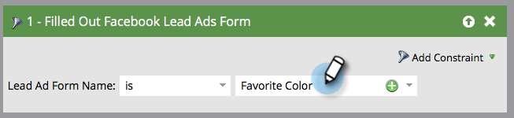

# Test di [!DNL Facebook] annunci per l&#39;integrazione desktop con Marketo {#test-facebook-lead-ads-for-desktop-integration-with-marketo}

Dopo aver creato l’annuncio lead, devi testarlo. Segui questi passaggi per eseguire questa operazione sul desktop.

>[!PREREQUISITES]
>
>È necessario [configurare l&#39;integrazione [!UICONTROL Facebook Lead Ads]](/help/marketo/product-docs/demand-generation/facebook/set-up-facebook-lead-ads.md).

1. In Facebook Power Editor, selezionare una campagna, un annuncio e fare clic su **[!UICONTROL Edit]**.

1. In **[!UICONTROL Links]**, fare clic sul collegamento **[!UICONTROL View in News Feed]**.

   

1. Verrai indirizzato a [!DNL Facebook] in una nuova scheda nel browser. Fare clic su [!UICONTROL Call to Action] nell&#39;unità annuncio lead [!DNL Facebook].

   

   >[!NOTE]
   >
   >Questo è un esempio che utilizza un Call to action Ulteriori informazioni. Il Call to action dell&#39;unità annuncio lead potrebbe essere diverso.

1. Inviare l&#39;unità di prova dell&#39;annuncio lead compilando il modulo sul desktop. Fai clic su **[!UICONTROL Submit]**.

   

1. Invio del modulo Annuncio lead completato.

   

1. Dopo aver inviato il modulo, [crea un elenco smart in Marketo](/help/marketo/product-docs/core-marketo-concepts/smart-lists-and-static-lists/creating-a-smart-list/create-a-smart-list.md) come parte di un programma o nel database che utilizza il filtro Modulo [!DNL Facebook] annunci lead compilati. Inserire il nome del modulo lead annuncio del modulo inviato.

   

1. Fare clic sulla scheda **[!UICONTROL People]** per verificare che la sincronizzazione funzioni correttamente.

   

>[!MORELIKETHIS]
>
>[Configura [!UICONTROL Facebook Lead Ads]](/help/marketo/product-docs/demand-generation/facebook/set-up-facebook-lead-ads.md)
