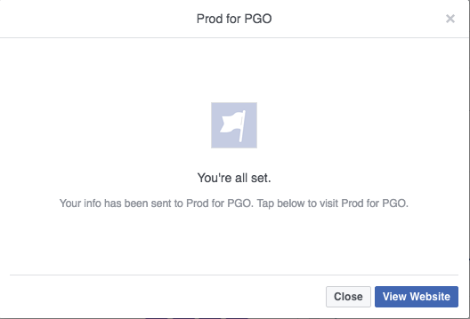

# Test degli annunci lead Facebook per l&#39;integrazione desktop con Marketo {#test-facebook-lead-ads-for-desktop-integration-with-marketo}

Dopo aver creato il tuo annuncio lead, devi testarlo! Ecco come farlo sul desktop.

>[!PREREQUISITES]
>
>È necessario [configurare l&#39;integrazione degli annunci lead di Facebook](set-up-facebook-lead-ads.md).

1. In Facebook Power Editor, selezionare una campagna, un annuncio, quindi fare clic su **Edit**.
1. In **Links** fare clic sul collegamento **Visualizza in News Feed**.

   

1. Verrai indirizzato a Facebook in una nuova scheda del browser. Fai clic su Invito all’azione nell’unità Annuncio lead di Facebook.

   

   >[!NOTE]
   >
   >Questo è solo un esempio, che utilizza un&#39;azione Ulteriori informazioni sulla chiamata all&#39;azione. La chiamata all&#39;azione dell&#39;unità di annuncio principale potrebbe essere diversa.

1. Inviate l&#39;unità di test Lead Ad compilando il modulo sul desktop. Fare clic su **Invia**.

   

1. Congratulazioni. È sufficiente inviare il modulo Annuncio lead.

   

1. Qui è dove avviene la magia! Dopo aver inviato il modulo, [creare un elenco smart in Marketo](../../../product-docs/core-marketo-concepts/smart-lists-and-static-lists/creating-a-smart-list/create-a-smart-list.md) nell&#39;ambito di un programma o nel database che utilizza il filtro Modulo lead per annunci Facebook compilati. Inserite il nome del modulo lead per il modulo appena inviato.

   

1. Ora fate clic sulla scheda **Persone** per verificare il corretto funzionamento della sincronizzazione.

   

   È figo o cosa?

>[!NOTE]
>
>**Articoli correlati**
>
>* [Impostazione Di Annunci Lead Facebook](set-up-facebook-lead-ads.md)

>

