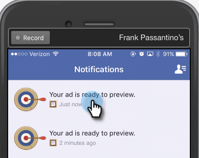
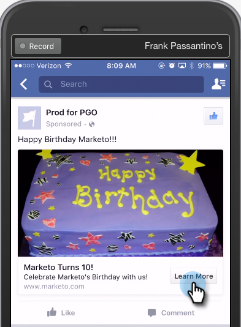

# Test degli annunci lead Facebook per l’integrazione con Marketo per dispositivi mobili {#test-facebook-lead-ads-for-mobile-integration-with-marketo}

Dopo aver creato il tuo annuncio lead, devi testarlo!

>[!PREREQUISITES]
>
>Devi [Configurare l’integrazione di Facebook Lead Ads](/help/marketo/product-docs/demand-generation/facebook/set-up-facebook-lead-ads.md).

1. In Facebook Power Editor, selezionare una campagna, un annuncio e fare clic su **Modifica**.

1. Sotto **Collegamenti**, fai clic su **Visualizza nell’app mobile** link.

   

1. Verrà inviata una nuova notifica all’account Facebook a cui puoi accedere sul dispositivo mobile con l’account autorizzato. Fai clic su **OK**.

   

1. Sul tuo dispositivo mobile, tocca **Notifiche** nell’app mobile Facebook.

   

1. In Notifiche, tocca **L&#39;annuncio è pronto per l&#39;anteprima**.

   

1. Invia l’unità del lead di test toccando l’azione Invito all’azione e compilando il modulo creato.

   

   >[!NOTE]
   >
   >Questo è solo un esempio, che utilizza un invito all&#39;azione per saperne di più. L’invito all’azione dell’unità annunci lead potrebbe essere diverso.

1. Ecco dove avviene la magia! Dopo aver inviato il modulo, [creare un elenco smart in Marketo](/help/marketo/product-docs/core-marketo-concepts/smart-lists-and-static-lists/creating-a-smart-list/create-a-smart-list.md) come parte di un programma o nel database lead che utilizza il **Modulo annunci lead Facebook compilato** filtro. Inserire il nome del modulo lead annuncio del modulo appena inviato.

   

1. Ora fai clic sulla scheda Lead per verificare che la sincronizzazione funzioni correttamente.

   

È fantastico o cosa?

>[!NOTE]
>
>[Attivare/disattivare Facebook Lead Ads](/help/marketo/product-docs/demand-generation/facebook/set-up-facebook-lead-ads.md)
