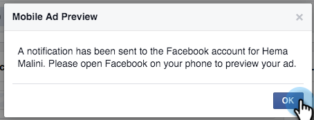

# Test degli annunci lead per Facebook per l’integrazione mobile con Marketo {#test-facebook-lead-ads-for-mobile-integration-with-marketo}

Dopo aver creato l’annuncio lead, devi testarlo.

>[!PREREQUISITES]
>
>È necessario [configurare l&#39;integrazione di Facebook Lead Ads](/help/marketo/product-docs/demand-generation/facebook/set-up-facebook-lead-ads.md).

1. In Facebook Power Editor, selezionare una campagna, un annuncio e fare clic su **Modifica**.

1. In **Collegamenti**, fai clic sul collegamento **Visualizza nell&#39;app mobile**.

   

1. All’account Facebook verrà inviata una nuova notifica a cui potrai accedere sul dispositivo mobile con l’account autorizzato. Fare clic su **OK**.

   

1. Sul tuo dispositivo mobile, tocca **Notifiche** nell&#39;app mobile di Facebook.

   

1. In Notifiche, tocca **L&#39;annuncio è pronto per l&#39;anteprima**.

   

1. Invia l&#39;unità di prova dell&#39;annuncio lead toccando l&#39;invito all&#39;azione e compilando il modulo creato.

   

   >[!NOTE]
   >
   >Questo è solo un esempio, che utilizza un Invito all’azione Ulteriori informazioni. L&#39;invito all&#39;azione dell&#39;unità dell&#39;annuncio lead potrebbe essere diverso.

1. Qui è dove avviene la magia! Dopo aver inviato il modulo, [crea un elenco smart in Marketo](/help/marketo/product-docs/core-marketo-concepts/smart-lists-and-static-lists/creating-a-smart-list/create-a-smart-list.md) come parte di un programma o nel database dei lead che utilizza il filtro **Modulo annunci lead Facebook compilato**. Inserisci il nome del modulo annuncio lead del modulo appena inviato.

   

1. A questo punto, fare clic sulla scheda Lead per verificare che la sincronizzazione funzioni correttamente.

   

È bello o cosa?

>[!NOTE]
>
>[Attiva/Disattiva annunci lead Facebook](/help/marketo/product-docs/demand-generation/facebook/set-up-facebook-lead-ads.md)
