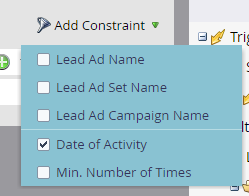

# Utilizzare filtri e attivatori lead Ads in una campagna avanzata {#use-lead-ads-filters-and-triggers-in-a-smart-campaign}

Quando hai abilitato Facebook Lead Ads, puoi utilizzarli nelle campagne intelligenti per vedere il successo del programma. Quando le persone inviano le loro informazioni in un&#39;unità Facebook Lead Ad, queste vengono inviate immediatamente a Marketo.

1. Utilizza la **Riempie il modulo Annunci lead** filtrare o attivare.

   

1. Aggiungi vincoli per personalizzarlo.

   
