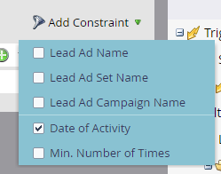

# Utilizzare filtri e attivatori per annunci sponsorizzati in una campagna avanzata {#use-lead-ads-filters-and-triggers-in-a-smart-campaign}

Dopo aver abilitato [!UICONTROL Facebook Lead Ads], puoi utilizzarli nelle campagne intelligenti per verificare il successo del programma. Quando le persone inviano le proprie informazioni in un&#39;unità annuncio lead di [!DNL Facebook], queste vengono inviate immediatamente a Marketo.

1. Utilizza il filtro o il trigger **[!UICONTROL Fills Out Facebook Lead Ads Form]**.

   

1. Aggiungete vincoli per personalizzarlo.

   
