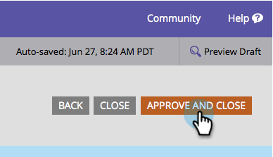

# Aggiungere un campo a un modulo {#add-a-field-to-a-form}

Una volta [creato il modulo](/help/marketo/product-docs/demand-generation/forms/creating-a-form/create-a-form.md) e [selezionato un tema](/help/marketo/product-docs/demand-generation/forms/creating-a-form/select-a-form-theme.md), puoi aggiungere altri campi da compilare per gli utenti. Ecco come.

1. Vai a **Attività di marketing**.

   

1. Seleziona il modulo e fai clic su **Modifica modulo**.

   

1. Fai clic sul pulsante **+** segno.

   

   >[!NOTE]
   >
   >Quando si crea un nuovo modulo, vengono aggiunti automaticamente Nome, Cognome e Indirizzo e-mail.

1. Individuare e selezionare il campo che si desidera aggiungere al modulo.

   

1. Aggiungi tutti i campi necessari e fai clic su **Fine**.

   

1. Ora fai clic su **Approva e chiudi**.

   

>[!NOTE]
>
>Assicurati di approvare tutte le bozze delle pagine di destinazione create a causa delle modifiche al modulo.

Niente male. Continuate il buon lavoro! Come impariamo come [rendere obbligatorio un campo modulo](/help/marketo/product-docs/demand-generation/forms/creating-a-form/make-a-form-field-required.md) successivo?
