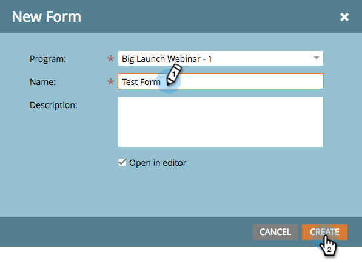

# Creare un modulo {#create-a-form}

Crea e utilizza un modulo in una pagina di destinazione per generare nuovi nomi. È davvero facile: ecco come iniziare.

>[!NOTE]
>
>Scopri le attività di Marketo [proteggere i moduli](https://nation.marketo.com/t5/Product-Documents/Forms-Service-Enhancements/ta-p/303670#M1038).

1. Vai a **Attività di marketing**.

   

1. Trova e seleziona il **programma**.

   

1. Sotto **Nuovo**, fai clic su **Nuovo** **Locale** **Risorsa**.

   

1. Seleziona **Modulo**.

   

1. Immetti un modulo **Nome** e fai clic su **Crea**.

   

>[!TIP]
>
>La maggior parte dei clienti crea un nuovo modulo per ogni pagina di destinazione, ma puoi anche creare un modulo da utilizzare con più pagine di destinazione. Sta interamente a te!

Dolce! Ora che il modulo è stato creato, procediamo e vestiamolo.

>[!MORELIKETHIS]
>
>* [Seleziona un tema modulo](/help/marketo/product-docs/demand-generation/forms/creating-a-form/select-a-form-theme.md)
>* [Aggiungere un set di campi a un modulo](/help/marketo/product-docs/demand-generation/forms/form-fields/add-a-fieldset-to-a-form.md)
