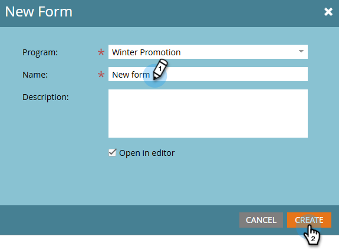

# Creare un modulo {#create-a-form}

Crea e utilizza un modulo su una pagina di destinazione per generare nuovi nomi o acquisire i dati desiderati.

>[!NOTE]
>
>Scopri cosa sta facendo Marketo Engage per [proteggere i moduli](https://nation.marketo.com/t5/Product-Documents/Forms-Service-Enhancements/ta-p/303670#M1038).

1. Vai a **[!UICONTROL Marketing Activities]**.

   

1. Trova il programma desiderato. Fare clic con il pulsante destro del mouse e selezionare **[!UICONTROL New Local Asset]**.

   

1. Seleziona **[!UICONTROL Form]**.

   

1. Immettere un modulo **[!UICONTROL Name]** e fare clic su **[!UICONTROL Create]**.

   

>[!TIP]
>
>La maggior parte degli utenti crea un nuovo modulo per ogni pagina di destinazione, ma puoi anche creare un modulo da utilizzare con più pagine di destinazione. Sta interamente a te!

>[!MORELIKETHIS]
>
>* [Seleziona un tema modulo](/help/marketo/product-docs/demand-generation/forms/creating-a-form/select-a-form-theme.md)
>* [Aggiungere un set di campi a un modulo](/help/marketo/product-docs/demand-generation/forms/form-fields/add-a-fieldset-to-a-form.md)
