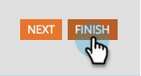

# Modificare un’etichetta di campo in un modulo {#edit-a-field-label-in-a-form}

L&#39;etichetta di un modulo può essere modificata in qualsiasi elemento, ad esempio è possibile utilizzare un&#39;immagine o cancellarla completamente. Ecco come farlo.

1. Vai a **[!UICONTROL Marketing Activities]**.

   

1. Selezionare il modulo e fare clic su **[!UICONTROL Create draft]**.

   

   >[!NOTE]
   >
   >Se il modulo non è ancora stato approvato, fare clic su **Modifica bozza**.

1. Selezionare il campo e quindi modificare **[!UICONTROL Label]**. I campi in Impostazioni modulo rifletteranno le etichette immesse.

   

   >[!TIP]
   >
   >Fai clic sull&#39;icona  per accedere all&#39;editor Rich Text.

1. Fai clic su **[!UICONTROL Finish]**.

   

1. Fai clic su **[!UICONTROL Approve and Close]**.

   

>[!NOTE]
>
>Non dimenticare di [approvare la bozza della pagina di destinazione](/help/marketo/product-docs/demand-generation/landing-pages/understanding-landing-pages/approve-unapprove-or-delete-a-landing-page.md){target="_blank"} creata dalle modifiche del modulo.
