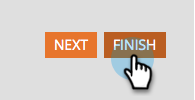

# Rendi obbligatorio un campo modulo {#make-a-form-field-required}

Quando [aggiungi campi a un modulo](/help/marketo/product-docs/demand-generation/forms/creating-a-form/add-a-field-to-a-form.md){target="_blank"}, potresti voler renderne alcuni obbligatori alla persona che li compila. Ecco come.

1. Vai a **[!UICONTROL Marketing Activities]**.

   

1. Selezionare il modulo e fare clic su **[!UICONTROL Create draft]**.

   

   >[!NOTE]
   >
   >Se il modulo non è stato approvato, fare clic su **Modifica bozza**.

1. Selezionare il campo da rendere obbligatorio e selezionare **[!UICONTROL Is Required]**.

   

1. Ben fatto! Fai clic su **[!UICONTROL Finish]**.

   

1. Fai clic su **[!UICONTROL Approve and Close]**.

   

>[!NOTE]
>
>Non dimenticare di [approvare le pagine di destinazione](/help/marketo/product-docs/demand-generation/landing-pages/understanding-landing-pages/approve-unapprove-or-delete-a-landing-page.md){target="_blank"} su cui si basa il modulo per attivare le modifiche.

>[!MORELIKETHIS]
>
>[Riordina i campi aggiunti al modulo](/help/marketo/product-docs/demand-generation/forms/form-fields/reorder-fields-in-a-form.md){target="_blank"}
