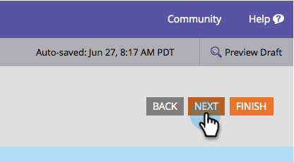

# Selezionare un tema del modulo {#select-a-form-theme}

Abbiamo fatto un sacco di bei temi per le vostre forme. Quale ti piace di più?

1. Vai a **Attività di marketing**.

   

1. Seleziona il modulo e fai clic su **Modifica modulo**.

   

1. Vai a **Impostazioni modulo**.

   

1. Passa avanti e indietro per scegliere il **Tema modulo** di tuo gradimento.

   

   Attualmente sono 7 i temi incorporati:

   * Semplice
   * Ingresso
   * Bagliore
   * Round
   * Buio
   * Ombreggiatura
   * Semplice

   >[!TIP]
   >
   >È inoltre possibile [modificare il CSS del tema del modulo](/help/marketo/product-docs/demand-generation/forms/form-design/edit-the-css-of-a-form-theme.md).

1. Fai clic su **Successivo** per configurare altre opzioni del modulo, oppure fai clic su **Fine** Se si desidera modificare solo il tema del modulo.

   

Quanto era facile?! Puoi lasciare che il tuo libro HTML/CSS raccolga della polvere ora.

>[!MORELIKETHIS]
>
>* [Modificare il CSS di un tema del modulo](/help/marketo/product-docs/demand-generation/forms/form-design/edit-the-css-of-a-form-theme.md)
>* [Aggiungere un campo a un modulo](/help/marketo/product-docs/demand-generation/forms/creating-a-form/add-a-field-to-a-form.md)

