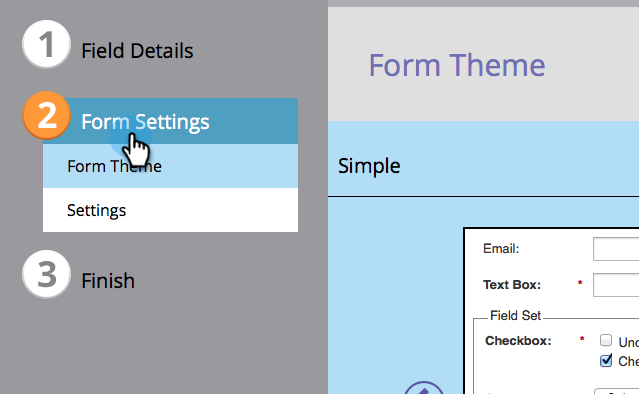

# Selezionare un tema per il modulo {#select-a-form-theme}

Sono disponibili diversi temi per i moduli.

1. Passa a **[!UICONTROL Marketing Activities]**.

   

1. Selezionare il modulo e fare clic su **[!UICONTROL Create draft]**.

   

   >[!NOTE]
   >
   >Se il modulo non è approvato, fare clic su **Modifica bozza**.

1. Passa a **[!UICONTROL Form Settings]**.

   

1. Passa da una posizione all&#39;altra per scegliere il **[!UICONTROL Form Theme]** desiderato.

   

   Attualmente sono presenti 7 temi incorporati:

   * Semplice
   * Interno
   * Bagliore
   * Arrotondamento
   * Scuro
   * Ombra
   * Semplice

   >[!TIP]
   >
   >Puoi anche [modificare il CSS del tema del modulo](/help/marketo/product-docs/demand-generation/forms/form-design/edit-the-css-of-a-form-theme.md){target="_blank"}.

1. Fare clic su **[!UICONTROL Next]** per configurare altre opzioni di modulo oppure su **[!UICONTROL Finish]** se si desidera modificare solo il tema del modulo.

   

>[!MORELIKETHIS]
>
>* [Modifica il CSS di un tema modulo](/help/marketo/product-docs/demand-generation/forms/form-design/edit-the-css-of-a-form-theme.md){target="_blank"}
>* [Aggiungere un campo a un modulo](/help/marketo/product-docs/demand-generation/forms/creating-a-form/add-a-field-to-a-form.md){target="_blank"}
