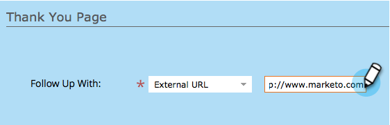
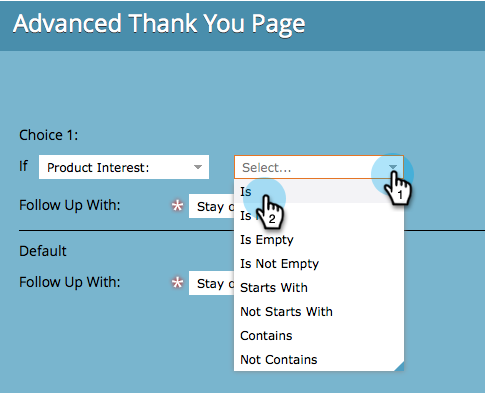
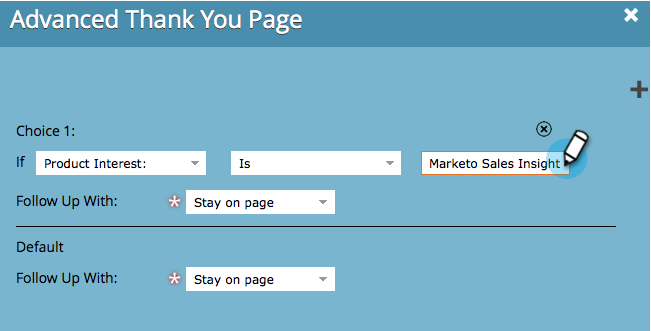
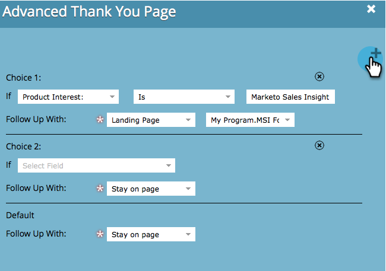

# Imposta la pagina di ringraziamento del modulo {#set-a-form-thank-you-page}

Cosa succede quando qualcuno compila un modulo? A dove vengono inoltrate? Ecco come configurarlo.

## Modifica modulo {#edit-form}

1. Vai a **Attività di marketing**.

   

1. Seleziona il modulo e fai clic su **Modifica modulo**.

   

1. Sotto **Impostazioni modulo** click **Impostazioni**.

   

1. Scorri verso il basso fino a **Pagina di ringraziamento** sezione .

## Resta sulla pagina {#stay-on-page}

L’opzione Resta sulla pagina manterrà il visitatore sulla stessa pagina dopo l’invio del modulo.

1. Seleziona **Resta sulla pagina** per **Segui con**.

   

## External URL {#external-url}

L’impostazione External URL ti consente di definire qualsiasi URL come pagina di follow-up. Una volta inviato il modulo, l’utente verrà indirizzato all’URL specificato.

1. Seleziona **External URL** per **Segui con**.

   

1. Immetti l’URL completo.

   

>[!TIP]
>
>L’URL può essere quello di un file ospitato da un punto qualsiasi; in questo caso, il pulsante &quot;Invia&quot; si comporta come un pulsante &quot;Scarica&quot;.

## Pagina di destinazione {#landing-page}

Puoi selezionare una pagina di destinazione Marketo approvata come follow-up.

1. Imposta **Segui con** a **Pagina di destinazione**.

   

1. Trova e seleziona la pagina di destinazione desiderata.

   

## Pagine di ringraziamento dinamiche {#dynamic-thank-you-pages}

Puoi aggiungere più opzioni e generare più opzioni nelle scelte per mostrare alle persone diversi follow-up in base alle loro risposte.

1. Fai clic su **Aggiungi scelta**.

   

1. Seleziona il campo di cui desideri monitorare la risposta.

   

   >[!TIP]
   >
   >A questo scopo sono disponibili solo i campi aggiunti al modulo.

1. Selezionare l’operatore logico desiderato.

   

1. Immettere uno dei valori con cui l&#39;utente risponderà.

   

1. Scegli la pagina appropriata per **Segui con** digitare.

   

1. Seleziona la pagina di destinazione appropriata.

   

   >[!NOTE]
   >
   >Devi aver creato/approvato anticipatamente queste pagine di destinazione.

1. Fai clic sul pulsante **+** firma per aggiungere un’altra scelta.

   

   >[!NOTE]
   >
   >Puoi aggiungere diverse opzioni. Tuttavia, se ne aggiungono troppi, può influire sulla velocità di caricamento del modulo, quindi aggiungere solo ciò che occorre.

1. Passare attraverso e configurare **Scelta 2**.

   

   >[!TIP]
   >
   >Sentiti libero di mescolare e abbinare i tipi di follow-up. Puoi utilizzare una pagina di destinazione per una scelta e un URL per un’altra.

1. Imposta una pagina Predefinita per tutte le altre risposte.

   

1. Seleziona la pagina stessa e fai clic su **Salva**.

   

   OK, sembra buono!

   

1. Fai clic su **Fine**.

   

1. Fai clic su **Approva e chiudi**.

   

Ottimo lavoro!
