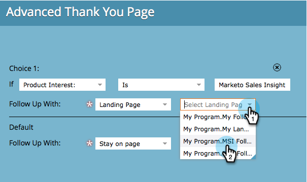

# Imposta una pagina di ringraziamento modulo {#set-a-form-thank-you-page}

Cosa succede quando qualcuno compila un modulo? A chi vengono inoltrati? Ecco come configurarlo.

## Modifica modulo {#edit-form}

1. Vai a **Attività di marketing**.

   

1. Seleziona il modulo e fai clic su **Modifica modulo**.

   

1. Sotto **Impostazioni modulo** click **Impostazioni**.

   

1. Scorri verso il basso fino a **Pagina di ringraziamento** sezione.

## Rimani sulla pagina {#stay-on-page}

L’opzione Resta sulla pagina manterrà il visitatore sulla stessa pagina quando il modulo è stato inviato.

1. Seleziona **Rimani sulla pagina** per **Completa con**.

   

## URL esterno {#external-url}

L’impostazione External URL (URL esterno) consente di definire qualsiasi URL come pagina di completamento. Una volta inviato il modulo, l’utente verrà indirizzato all’URL specificato.

1. Seleziona **URL esterno** per **Completa con**.

   

1. Inserisci l’URL completo.

   

>[!TIP]
>
>L’URL può essere quello di un file ospitato da qualche parte - in questo caso, il pulsante &quot;Invia&quot; si comporterà come un pulsante &quot;Scarica&quot;.

## Pagina di destinazione {#landing-page}

Puoi selezionare una pagina di destinazione di Marketo approvata come follow-up.

1. Imposta **Completa con** a **Pagina di destinazione**.

   

1. Individua e seleziona la pagina di destinazione desiderata.

   

## Pagine di ringraziamento dinamiche {#dynamic-thank-you-pages}

È possibile aggiungere più opzioni e creare scelte per mostrare alle persone follow-up diversi a seconda delle loro risposte.

1. Clic **Aggiungi scelta**.

   

1. Seleziona il campo di cui desideri monitorare la risposta.

   

   >[!TIP]
   >
   >A questo scopo sono disponibili solo i campi aggiunti al modulo.

1. Selezionare l&#39;operatore logico desiderato.

   

1. Immettere uno dei valori con cui l&#39;utente risponderà.

   

1. Scegli la pagina appropriata per **Completa con** tipo.

   

1. Seleziona la pagina di destinazione appropriata.

   

   >[!NOTE]
   >
   >Devi aver creato/approvato queste pagine di destinazione in anticipo.

1. Fai clic su **+** accedi per aggiungere un&#39;altra scelta.

   

   >[!NOTE]
   >
   >Puoi aggiungere diverse scelte. Se ne aggiungi troppi, tuttavia, può influire sulla velocità di caricamento del modulo, quindi aggiungi solo ciò che ti serve.

1. Eseguire e configurare **Scelta 2**.

   

   >[!TIP]
   >
   >Puoi anche combinare diversi tipi di follow-up. Puoi utilizzare una pagina di destinazione per una scelta e un URL per un’altra.

1. Imposta una pagina predefinita per tutte le altre risposte.

   

1. Seleziona la pagina stessa e fai clic su **Salva**.

   

   OK, sta bene!

   

1. Clic **Fine**.

   

1. Clic **Approva e chiudi**.

   

Ottimo lavoro!
