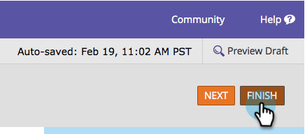

# Aggiungere una lista di selezione per paese al modulo {#add-a-country-picklist-to-your-form}

Seguire queste istruzioni per convertire il campo paese in un elenco a discesa con un elenco di tutti i paesi.

1. Vai a **Attività di marketing**.

   

1. Seleziona il modulo e fai clic su **Modifica modulo**.

   

1. Fai clic sul pulsante **+** segno.

   

1. Trova e seleziona **Paese**.

   

1. Con la **Paese** campo selezionato modifica **Tipo di campo** a **Seleziona**.

   

1. **Modifica** la **Valori** per aggiungere l’elenco dei paesi tra cui gli utenti possono scegliere.

   

1. Fai clic su **Avanzate** **Editor**.

   

1. Selezionare e copiare questo elenco di paesi:

   ```
   Afghanistan Albania Algeria Andorra Angola Antigua & Deps Argentina Armenia Australia Austria Azerbaijan Bahamas Bahrain Bangladesh Barbados Belarus Belgium Belize Benin Bhutan Bolivia Bosnia Herzegovina Botswana Brazil Brunei Bulgaria Burkina Burundi Cambodia Cameroon Canada Cape Verde Central African Rep Chad Chile China Colombia Comoros Congo Congo (Democratic Rep) Costa Rica Croatia Cuba Cyprus Czech Republic Denmark Djibouti Dominica Dominican Republic East Timor Ecuador Egypt El Salvador Equatorial Guinea Eritrea Estonia Ethiopia Fiji Finland France Gabon Gambia Georgia Germany Ghana Greece Grenada Guatemala Guinea Guinea-Bissau Guyana Haiti Honduras Hungary Iceland India Indonesia Iran Iraq Ireland (Republic) Israel Italy Ivory Coast Jamaica Japan Jordan Kazakhstan Kenya Kiribati Korea North Korea South Kosovo Kuwait Kyrgyzstan Laos Latvia Lebanon Lesotho Liberia Libya Liechtenstein Lithuania Luxembourg Macedonia Madagascar Malawi Malaysia Maldives Mali Malta Marshall Islands Mauritania Mauritius Mexico Micronesia Moldova Monaco Mongolia Montenegro Morocco Mozambique Myanmar (Burma) Namibia Nauru Nepal Netherlands New Zealand Nicaragua Niger Nigeria Norway Oman Pakistan Palau Panama Papua New Guinea Paraguay Peru Philippines Poland Portugal Qatar Romania Russian Federation Rwanda St Kitts & Nevis St Lucia Saint Vincent & the Grenadines Samoa San Marino Sao Tome & Principe Saudi Arabia Senegal Serbia Seychelles Sierra Leone Singapore Slovakia Slovenia Solomon Islands Somalia South Africa South Sudan Spain Sri Lanka Sudan Suriname Swaziland Sweden Switzerland Syria Taiwan Tajikistan Tanzania Thailand Togo Tonga Trinidad & Tobago Tunisia Turkey Turkmenistan Tuvalu Uganda Ukraine United Arab Emirates United Kingdom United States Uruguay Uzbekistan Vanuatu Vatican City Venezuela Vietnam Yemen Zambia Zimbabwe
   ```

1. Incolla l’elenco nell’editor.

   

   >[!TIP]
   >
   >Puoi modificare l’elenco o utilizzare qualsiasi altro elenco.

1. Fai clic su **Salva**.

   

1. Fai clic su **Fine**.

   

1. Fai clic su **Approva e chiudi**.

   

   Ben fatto! Ora, quando una persona compila il modulo, può scegliere dall’elenco dei paesi che hai fornito.

   

Dato che era così facile, perché non fare di più? Che ne dici di visualizzare in modo dinamico il campo Stato quando un utente seleziona Stati Uniti come paese nell’elenco? Consulta il relativo articolo qui sotto per scoprire come farlo.

>[!MORELIKETHIS]
>
>[Attiva/disattiva dinamicamente la visibilità di un campo modulo](/help/marketo/product-docs/demand-generation/forms/form-fields/dynamically-toggle-visibility-of-a-form-field.md)
