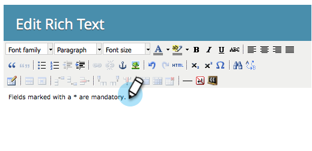

# Aggiungere testo formattato a un modulo {#add-rich-text-to-a-form}

Utilizzare il formato RTF in un modulo per aggiungere istruzioni o altre informazioni tra i campi.

1. Passa a **[!UICONTROL Marketing Activities]**.

   

1. Selezionare il modulo e fare clic su **[!UICONTROL Edit Form]**.

   

1. Fai clic sul segno **+**.

   

1. Seleziona **[!UICONTROL Rich Text]**.

   

1. Immettere il testo desiderato.

   

   >[!TIP]
   >
   >Se nel modulo è necessario un separatore di linea, utilizzare il pulsante Linea orizzontale.

1. Fai clic su **[!UICONTROL Save]**.

   

1. Fai clic su **[!UICONTROL Finish]**.

   

1. Fai clic su **[!UICONTROL Approve and Close]**.

   

   

>[!TIP]
>
>Sapevi che puoi anche [aggiungere regole di visibilità](/help/marketo/product-docs/demand-generation/forms/form-fields/dynamically-toggle-visibility-of-a-form-field.md) a un blocco di testo RTF?
