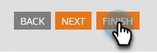

# Modificare la lingua di un modulo {#change-the-language-of-a-form}

Scopri come modificare la lingua del modulo.

>[!IMPORTANT]
>
>Seguendo i passaggi descritti in questo articolo verrà modificata la lingua dei campi standard di Marketo, nonché la dicitura utilizzata nell’etichetta del pulsante Invia. Non tradurrà [campi personalizzati](/help/marketo/product-docs/administration/field-management/create-a-custom-field-in-marketo.md){target="_blank"}.

1. Vai a **Attività di marketing**.

   

1. Seleziona il modulo e fai clic su **Modifica modulo**.

   

1. Fai clic su **Impostazioni modulo** e seleziona **Impostazioni**.

   

1. Seleziona la **Lingua modulo** desiderata.

   

   PASSO FACOLTATIVO: scegliere la lingua o l&#39;area geografica della lingua selezionata.

   

1. Fai clic su **Fine**.

   

1. Fai clic su **Approva e chiudi** per applicare e salvare le modifiche.

   

   >[!NOTE]
   >
   >Il modulo deve essere approvato per essere utilizzato nelle pagine di destinazione.

   >[!TIP]
   >
   >Ricorda di [approvare la bozza della pagina di destinazione](/help/marketo/product-docs/demand-generation/landing-pages/understanding-landing-pages/approve-unapprove-or-delete-a-landing-page.md) creata dalle modifiche del modulo.

Il modulo ora rifletterà la lingua selezionata.

