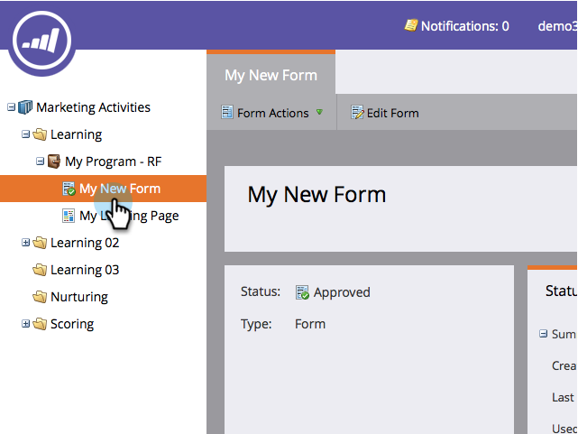

# Eliminare un modulo {#delete-a-form}

Se si dispone di un modulo non necessario e non utilizzato, è possibile eliminarlo. Ecco come.

1. Andate a **Marketing Activities**.

   

1. Trovare e selezionare il modulo.

   

1. In **Azioni modulo** fare clic su **Elimina modulo**.

   

   >[!NOTE]
   >
   >Ricordare di rimuovere il modulo da una o tutte le pagine di destinazione che lo utilizzano. Inoltre, verificare che il modulo non sia utilizzato in un sito Web pubblico.

1. Confermare facendo clic su **Elimina**.

   

1. Se il modulo viene utilizzato in una pagina di destinazione Marketo, non sarà possibile eliminarlo. Bisogna andare a rimuoverlo dalle pagine di destinazione su cui si trova.

   

>[!CAUTION]
>
>Se si elimina un modulo utilizzato dal sito Web pubblico, non verrà visualizzato alcun avviso e il modulo verrà interrotto. Analizzare [l&#39;archiviazione](/help/marketo/product-docs/email-marketing/drip-nurturing/using-stream-content/archive-and-unarchive-stream-content.md).
