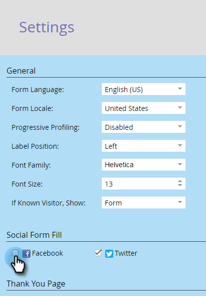

# Disabilitare la compilazione di un modulo di contatto {#disable-social-form-fill}

A volte è meglio non inviare più i moduli tramite un profilo social. Ecco come disattivarlo.

>[!AVAILABILITY]
>
>Questa funzionalità non è stata acquistata da tutti i clienti.

1. Passa a **[!UICONTROL Marketing Activities]**.

   

1. Selezionare il modulo e fare clic su **[!UICONTROL Edit Form]**.

   

1. In [!UICONTROL Form Settings] fare clic su **[!UICONTROL Settings]**.

   

1. Deseleziona la casella di controllo del social network che non desideri includere.

   

1. Fai clic su **[!UICONTROL Finish]**.

   

1. Fai clic su **[!UICONTROL Approve and Close]**.

   
